# SwarmSDK: Multi-Agent AI Orchestration Framework

**Version 2.0.0** - A lightweight, single-process framework for building collaborative AI agent systems using RubyLLM.

---

## Table of Contents

1. [Overview](#overview)
2. [Quick Comparison: SwarmSDK vs ClaudeSwarm v1](#quick-comparison-swarmsdk-vs-claudeswarm-v1)
3. [Quick Start](#quick-start)
4. [Design Philosophy](#design-philosophy)
5. [Library-First Design](#library-first-design)
6. [Unified Logging System](#unified-logging-system)
7. [Callback System](#callback-system)
8. [Architecture](#architecture)
9. [Core Components](#core-components)
10. [Configuration Format](#configuration-format)
11. [Agent Lifecycle](#agent-lifecycle)
12. [Tool Calling System](#tool-calling-system)
13. [Delegation System](#delegation-system)
14. [Concurrency Model](#concurrency-model)
15. [Permissions System](#permissions-system)
16. [OpenAI Responses API Support](#openai-responses-api-support)
17. [Scratchpad System](#scratchpad-system)
18. [Error Handling](#error-handling)
19. [Data Flow](#data-flow)

---

## Overview

SwarmSDK is a **complete reimagining** of Claude Swarm that decouples from Claude Code and runs everything in a **single Ruby process** using **RubyLLM** for all LLM interactions. It enables building collaborative AI development teams where specialized agents work together to solve complex problems.

### Key Features

- 🚀 **Single Process**: No inter-process communication overhead - all agents run in the same Ruby process
- 🔌 **RubyLLM Integration**: Unified interface for multiple LLM providers (OpenAI, Anthropic, Google, etc.)
- 🎯 **Direct Tool Calling**: Method calls instead of MCP protocol - simpler and faster
- 🔄 **Parallel Execution**: Built-in concurrency with configurable rate limiting
- 📊 **Unified Logging**: Comprehensive observability with structured logs and streaming support
- 🛡️ **Permission System**: Fine-grained file access control with glob patterns
- 📝 **Scratchpad Memory**: Shared in-memory storage for agent collaboration
- 🔧 **Dual API**: Ruby API for programmatic use, YAML for declarative configuration
- 📦 **Built-in Tools**: Read, Write, Edit, Bash, Grep, Glob, and more
- 🌐 **Responses API Support**: Full support for OpenAI's Responses API with multi-turn conversations

---

## Quick Comparison: SwarmSDK vs ClaudeSwarm v1

| Aspect | ClaudeSwarm v1 | SwarmSDK v2 |
|--------|----------------|-------------|
| **Architecture** | Multi-process (separate Claude Code instances) | Single process (one Ruby VM) |
| **Configuration** | `instances` in YAML | `agents` in YAML |
| **Agent Definition** | Inline in YAML | Separate Markdown files with frontmatter |
| **Communication** | MCP protocol (stdio/SSE/HTTP) | Direct Ruby method calls |
| **LLM Integration** | Claude Code SDK | RubyLLM gem |
| **Tool System** | MCP tool protocol | RubyLLM::Tool classes |
| **Delegation** | MCP server connections | Tool-based delegation |
| **Logging** | Per-instance logs | Unified structured logging |
| **Concurrency** | Process-level parallelism | Fiber-based async with Async gem |
| **Memory Overhead** | High (multiple processes) | Low (single process) |
| **Version** | `version: 1` | `version: 2` |
| **Backward Compatibility** | N/A | ⚠️ **NOT backward compatible** |

### Breaking Changes

SwarmSDK v2 is a **complete redesign** and is **NOT backward compatible** with v1:

1. **Configuration Format**: `version: 2` required, `swarm.agents` instead of `swarm.instances`
2. **Agent Definitions**: Use Markdown files with YAML frontmatter + system prompts
3. **No MCP**: Direct tool calling replaces MCP inter-process communication
4. **No Claude Code**: RubyLLM replaces Claude Code SDK
5. **New Tool System**: RubyLLM::Tool base class instead of MCP tools
6. **Delegation Changes**: `delegates_to` creates dynamic tools instead of MCP connections

---

## Quick Start

### Installation

```ruby
# Gemfile
gem "swarm_sdk", "~> 2.0"
```

```bash
bundle install
```

### Ruby API Example

```ruby
require "swarm_sdk"

# Create the swarm
swarm = SwarmSDK::Swarm.new(
  name: "Development Team",
  global_concurrency: 50,        # Max 50 concurrent LLM calls across swarm
  default_local_concurrency: 10  # Each agent can make 10 concurrent tool calls
)

# Add agents
swarm.add_agent(
  name: :architect,
  description: "Lead architect coordinating the team",
  model: "gpt-5",
  system_prompt: "You are the lead architect. Coordinate work between teams.",
  tools: [:Read, :Edit, :Bash],
  delegates_to: [:backend, :frontend],
  directory: "."  # Singular in 1.0+
)

swarm.add_agent(
  name: :backend,
  description: "Backend developer specializing in APIs",
  model: "claude-sonnet-4",
  system_prompt: "You build scalable backend architecture.",
  tools: [:Read, :Write, :Edit, :Bash],
  directory: "./backend"  # Singular in 1.0+
)

swarm.add_agent(
  name: :frontend,
  description: "Frontend developer specializing in React",
  model: "gpt-5",
  system_prompt: "You build clean, maintainable React applications.",
  tools: [:Read, :Write, :Edit],
  directory: "./frontend"  # Singular in 1.0+
)

# Set lead agent
swarm.lead = :architect

# Execute with streaming logs
result = swarm.execute("Build a user authentication system") do |log_entry|
  case log_entry[:type]
  when "agent_stop"
    puts "[#{log_entry[:agent]}] #{log_entry[:usage][:total_tokens]} tokens"
  when "agent_delegation"
    puts "[#{log_entry[:agent]}] Delegating to #{log_entry[:delegate_to]}"
  end
end

# Check result
if result.success?
  puts result.content
  puts "Cost: $#{result.total_cost}"
  puts "Agents involved: #{result.agents_involved.join(", ")}"
else
  puts "Error: #{result.error.message}"
end
```

### YAML API Example

```yaml
# swarm.yml
version: 2

swarm:
  name: "Development Team"
  lead: architect

  # Optional: Settings applied to all agents
  all_agents:
    tools: [Write, Edit]  # Common tools for all agents
    permissions:
      Read:
        allowed_paths: ["**/*"]
        denied_paths: ["secrets/**"]

  agents:
    architect:
      description: "Lead architect coordinating the team"
      model: gpt-5
      system_prompt: "You are the lead architect. Coordinate work between teams."
      tools:
        - Read
        - Edit
        - Bash
      delegates_to:
        - backend
        - frontend
      directory: "."

    backend:
      agent_file: "agents/backend.md"  # Load from Markdown file
      tools:
        - Read
        - Write
        - Edit
        - Bash
      directory: "./backend"
      # Optional: Agent-specific permissions override defaults
      permissions:
        Write:
          allowed_paths: ["backend/**/*"]

    frontend:
      agent_file: "agents/frontend.md"
      tools: [Read, Write, Edit]
      directory: "./frontend"
```

```markdown
<!-- agents/backend.md -->
---
model: claude-sonnet-4
description: Backend developer specializing in APIs
---

You are a backend developer specializing in APIs and databases.
Build scalable backend architecture with clean code practices.
```

```ruby
# Load and execute
swarm = SwarmSDK::Swarm.load("swarm.yml")
result = swarm.execute("Build authentication API")
```

### Configuring Tools for All Agents

By default, all agents get these tools automatically:
- **Read**, **Grep**, **Glob** - File system exploration and search
- **TodoWrite** - Task management
- **ScratchpadWrite/Read/List** - Shared memory storage

You can add common tools and control default tools:

**Ruby API:**
```ruby
# Add common tools for all agents (in addition to defaults)
swarm.add_agent(
  name: :developer,
  tools: [:Write, :Edit],           # Agent-specific tools
  include_default_tools: true       # Include built-in defaults (default: true)
)

# Disable default tools for specific agent
swarm.add_agent(
  name: :minimal,
  tools: [:Bash],
  include_default_tools: false      # Only gets Bash
)
```

**YAML API:**
```yaml
version: 2
swarm:
  name: "My Swarm"
  lead: main

  all_agents:
    # Tools added to ALL agents (in addition to built-in defaults)
    tools:
      - Write
      - Edit

    # Optional: Disable built-in defaults for all agents
    include_default_tools: true  # default: true

  agents:
    main:
      description: "Main agent"
      model: gpt-5
      system_prompt: "You are the main agent"
      tools: [Bash]  # Gets: defaults + Write, Edit + Bash

    minimal:
      description: "Minimal agent"
      model: gpt-5
      system_prompt: "You are minimal"
      tools: [Grep]
      include_default_tools: false  # Override: only gets Write, Edit, Grep
```

**Tool precedence:** Built-in defaults → all_agents.tools → agent.tools

---

## Design Philosophy

SwarmSDK is built on several core principles:

### 1. **Library-First Design**

SwarmSDK is designed as a **library, not a framework**. This means:

- ✅ **Programmatic API is primary**: Ruby API is the main interface
- ✅ **YAML is convenience**: YAML configuration is a thin wrapper over Ruby API
- ✅ **Composable**: Use as building blocks in larger applications
- ✅ **Embeddable**: Integrate into existing Ruby applications
- ✅ **Testable**: Easy to unit test and mock

### 2. **Single Process Efficiency**

All agents run in the same Ruby process:

- 🚀 **Lower Memory**: No duplicate process overhead
- ⚡ **Faster Communication**: Direct method calls, not IPC
- 🎯 **Simpler Debugging**: Single process to debug
- 📊 **Unified Logging**: All logs in one stream

### 3. **Explicit Over Implicit**

Configuration and behavior should be explicit:

- 🔍 **No Magic**: Clear, predictable behavior
- 📋 **Explicit Dependencies**: Tools and delegations declared upfront
- 🛡️ **Explicit Permissions**: Security by default with opt-in permissions
- 📝 **Typed Parameters**: Clear parameter types and validation

### 4. **Progressive Disclosure**

Start simple, add complexity as needed:

- 🌱 **Simple Start**: Minimal configuration for basic use
- 🌳 **Advanced Features**: Permissions, MCP, custom providers available
- 🔧 **Escape Hatches**: Direct access to underlying components

### 5. **Safety and Reliability**

Production-ready safety features:

- 🔒 **Read-Before-Write**: Enforced context before modifications
- 🛡️ **Permission System**: Fine-grained file access control
- 🚦 **Rate Limiting**: Prevent API quota exhaustion
- ⚠️ **Error Recovery**: Graceful degradation and clear error messages

---

## Library-First Design

### Ruby API: The Foundation

The **Ruby API is the primary interface**. It provides full programmatic control:

```ruby
swarm = SwarmSDK::Swarm.new(name: "My Swarm")

swarm.add_agent(
  name: :developer,
  description: "Software developer",
  model: "gpt-5",
  system_prompt: "You write clean code.",
  tools: [:Read, :Write, :Edit]
)

swarm.lead = :developer

result = swarm.execute("Refactor authentication")
```

### YAML API: Convenience Layer

YAML is a **thin wrapper** that converts to Ruby API calls:

```yaml
# This YAML...
version: 2
swarm:
  name: "My Swarm"
  lead: developer
  agents:
    developer:
      description: "Software developer"
      model: gpt-5
      system_prompt: "You write clean code."
      tools: [Read, Write, Edit]
```

```ruby
# ...is converted to this Ruby API:
config = SwarmSDK::Configuration.load("swarm.yml")
swarm = config.to_swarm  # Calls Swarm.new and add_agent internally
```

### Configuration#to_swarm Bridge

The `Configuration#to_swarm` method shows how YAML maps to Ruby API:

```ruby
# lib/swarm_sdk/configuration.rb:57
def to_swarm
  swarm = Swarm.new(
    name: @swarm_name,
    global_concurrency: Swarm::DEFAULT_GLOBAL_CONCURRENCY,
    default_local_concurrency: Swarm::DEFAULT_LOCAL_CONCURRENCY
  )

  # Add all agents using Ruby API
  @agents.each do |name, agent_def|
    swarm.add_agent(
      name: name,
      description: agent_def.description,
      model: agent_def.model,
      system_prompt: agent_def.system_prompt,
      # ... more fields
    )
  end

  swarm.lead = @lead_agent
  swarm
end
```

---

## Unified Logging System

SwarmSDK provides comprehensive **structured logging** with streaming support.

### Architecture

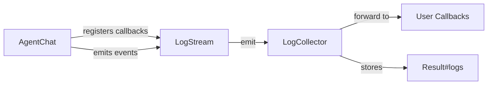

### Log Entry Types

```ruby
# User Request
{
  type: "user_request",
  agent: :backend,
  model: "claude-sonnet-4",
  provider: "anthropic",
  message_count: 5,
  tools: [:read, :write],              # Actual tools, not delegates
  delegates_to: ["frontend", "database"], # Agent names this agent can call
  timestamp: "2025-10-06T10:30:00Z"
}

# Agent Stop
{
  type: "agent_stop",
  agent: :backend,
  model: "claude-sonnet-4",
  content: "I'll create the API endpoint...",
  tool_calls: [
    { id: "call_123", name: "write", arguments: {...} }
  ],
  finish_reason: "tool_calls",
  usage: {
    input_tokens: 1500,
    output_tokens: 300,
    total_tokens: 1800,
    input_cost: 0.0045,
    output_cost: 0.0045,
    total_cost: 0.009
  },
  tool_executions: [...],
  timestamp: "2025-10-06T10:30:05Z"
}

# Tool Call (regular tool)
{
  type: "tool_call",
  agent: :backend,
  tool_call_id: "call_123",
  tool: "write",
  arguments: { file_path: "api.rb", content: "..." },
  timestamp: "2025-10-06T10:30:06Z"
}

# Tool Result
{
  type: "tool_result",
  agent: :backend,
  tool_call_id: "call_123",
  result: "Successfully created file: api.rb",
  timestamp: "2025-10-06T10:30:07Z"
}

# Agent Delegation (special tool call)
{
  type: "agent_delegation",
  agent: :architect,
  tool_call_id: "call_456",
  delegate_to: "backend",
  arguments: { task: "Build authentication API" },
  timestamp: "2025-10-06T10:30:10Z"
}

# Delegation Result
{
  type: "delegation_result",
  agent: :architect,
  delegate_from: "backend",
  tool_call_id: "call_456",
  result: "API created successfully",
  timestamp: "2025-10-06T10:31:00Z"
}
```

### Streaming Logs

```ruby
result = swarm.execute("Build API") do |log_entry|
  case log_entry[:type]
  when "user_request"
    puts "🔄 [#{log_entry[:agent]}] Starting LLM call (#{log_entry[:model]})"

  when "agent_stop"
    usage = log_entry[:usage]
    puts "✅ [#{log_entry[:agent]}] #{usage[:total_tokens]} tokens ($#{format("%.6f", usage[:total_cost])})"

  when "tool_call"
    puts "🔧 [#{log_entry[:agent]}] Tool: #{log_entry[:tool]}"

  when "agent_delegation"
    puts "👥 [#{log_entry[:agent]}] → Delegating to #{log_entry[:delegate_to]}"

  when "delegation_result"
    puts "✅ [#{log_entry[:agent]}] ← Result from #{log_entry[:delegate_from]}"
  end
end

# Logs are also stored in result
result.logs.each do |log_entry|
  # Post-process logs
end
```

### Cost Tracking

SwarmSDK automatically calculates costs using RubyLLM's model registry:

```ruby
result = swarm.execute("Build API")

# Per-agent costs in logs
result.logs.each do |entry|
  if entry[:type] == "agent_stop"
    puts "#{entry[:agent]}: $#{entry[:usage][:total_cost]}"
  end
end

# Aggregate costs
puts "Total cost: $#{result.total_cost}"
puts "Total tokens: #{result.total_tokens}"
puts "LLM requests: #{result.llm_requests}"
```

### Delegation vs Tool Distinction

The logger distinguishes between **tool calls** (regular tools) and **delegation** (agent-to-agent):

```ruby
# Configuration tells logger which tools are agents
@logger.attach_to_chat(
  chat,
  agent_name: :architect,
  delegation_tools: ["backend", "frontend"]  # These are agents, not tools
)

# When tool is called:
if delegation?(agent_name, tool_call.name)
  log_agent_delegation(...)  # Logs as "agent_delegation"
else
  log_tool_call(...)         # Logs as "tool_call"
end
```

---

## Callback System

SwarmSDK provides a **powerful callback system** for customizing agent behavior, adding validation, monitoring, and extending functionality.

### Overview

The callback system allows you to hook into various events during swarm execution:

- **Swarm lifecycle** - When swarm is created, when first message is sent
- **Agent/LLM events** - Before/after LLM requests
- **Tool events** - Before/after tool execution (can block/modify)
- **Delegation events** - Before/after agent-to-agent delegation (exclusive, don't fire tool events)
- **Context events** - When context usage crosses thresholds

**All logging is now implemented via callbacks**, making it fully customizable.

**Key Feature**: Delegation events are **exclusive** - when calling a delegation tool, only `pre_delegation` and `post_delegation` fire (not `pre_tool_use` or `post_tool_use`). This provides clean separation between regular tool use and agent delegation.

### Available Events

All callbacks receive a `HookContext` and can return a `HookResult` to control execution flow.

```ruby
# Swarm lifecycle events
:swarm_start       # When Swarm.execute is called (before execution)
                   # Can: halt execution

:swarm_stop        # When Swarm.execute completes (after execution)
                   # Can: reprompt lead agent to continue

:first_message     # When Swarm.execute is first called (once per swarm)
                   # Can: halt execution before first message

# Agent/LLM events
:user_prompt      # Before sending user message to LLM
                   # Can: halt and return custom response

:agent_stop        # After agent completes response (tool calls or final message)
                   # Has: access to agent response and metadata

# Tool events
:pre_tool_use      # Before tool execution
                   # Can: halt, or replace with custom result (skip execution)

:post_tool_use     # After tool execution
                   # Can: replace tool result with modified value

# Delegation events (EXCLUSIVE - do not fire tool events)
:pre_delegation    # Before delegating to another agent
                   # Can: halt delegation, or replace with custom result

:post_delegation   # After delegation completes
                   # Can: replace delegation result

# IMPORTANT: Delegation events are EXCLUSIVE
# When calling a delegation tool: pre_delegation → delegate → post_delegation
# Tool events (pre_tool_use/post_tool_use) do NOT fire for delegations

# Context events
:context_warning   # When context usage crosses threshold (80%, 90%)
                   # Has: access to chat instance for message manipulation
```

### HookResult: Steering Behavior

Callbacks control execution flow by returning a `HookResult` object:

```ruby
# Continue normal execution (default when returning nil)
HookResult.continue
HookResult.continue(modified_context)  # With updated context

# Halt execution with message
HookResult.halt("Validation failed: invalid input")

# Replace a value (tool result, delegation result)
HookResult.replace("Custom tool result")

# Reprompt agent with new prompt (swarm_stop only)
HookResult.reprompt("Please provide more details")
```

**Return value behavior**:
- `nil` → Continue with unmodified context
- `HookResult` → Control execution flow
- Logging callbacks return `nil` implicitly (observe only, don't steer)

#### Steering Examples by Event

```ruby
# 1. Halt swarm execution (swarm_start)
swarm.add_default_callback(:swarm_start) do |context|
  if context.metadata[:prompt].include?("dangerous")
    HookResult.halt("Dangerous operation blocked by policy")
  end
  # nil = continue
end

# 2. Reprompt on completion (swarm_stop)
swarm.add_default_callback(:swarm_stop) do |context|
  result = context.metadata[:result]
  if result.content.length < 100
    HookResult.reprompt("Please provide a more detailed response with examples")
  end
  # nil = execution complete
end

# 3. Halt before first message (first_message)
swarm.add_default_callback(:first_message) do |context|
  unless authorized?(context.metadata[:prompt])
    HookResult.halt("Unauthorized task")
  end
end

# 4. Halt user request (user_request)
swarm.add_default_callback(:user_prompt) do |context|
  if context.metadata[:prompt].include?("delete database")
    HookResult.halt("Cannot execute destructive operations")
  end
end

# 5. Provide custom tool result (pre_tool_use)
swarm.add_default_callback(:pre_tool_use, matcher: "Write") do |context|
  file_path = context.tool_call.parameters[:file_path]

  if file_path.include?("secret")
    # Skip tool execution, return custom result
    HookResult.replace("Access denied: cannot write to secret files")
  end
  # nil = execute tool normally
end

# 6. Modify tool result (post_tool_use)
swarm.add_default_callback(:post_tool_use, matcher: "Read") do |context|
  content = context.tool_result.content

  # Redact sensitive data
  modified = content.gsub(/password=[^\s]+/, "password=***")
  HookResult.replace(modified)
end

# 7. Halt delegation (pre_delegation)
swarm.add_default_callback(:pre_delegation) do |context|
  if budget_exceeded?(context.delegation_target)
    HookResult.halt("Budget exceeded for #{context.delegation_target}")
  end
end

# 8. Modify delegation result (post_delegation)
swarm.add_default_callback(:post_delegation) do |context|
  result = context.delegation_result

  # Add validation stamp
  modified = "#{result}\n\n[Validated by security team]"
  HookResult.replace(modified)
end

# 9. Manipulate context (context_warning)
swarm.add_default_callback(:context_warning) do |context|
  if context.metadata[:percentage] > 90
    chat = context.metadata[:chat]

    # Remove older messages to free up context
    chat.messages.shift(10)

    puts "Removed 10 old messages to free context space"
  end
  # nil = just observe, don't steer
end
```

### Programmatic API

#### Named Callbacks (Reusable)

```ruby
swarm = SwarmSDK::Swarm.new(name: "Team")

# Register a named callback
swarm.register_hook(:validate_code) do |context|
  if context.tool_name == "Write"
    content = context.tool_call.parameters[:content]

    # Perform validation
    errors = lint_code(content)

    if errors.any?
      # Block execution with HookResult
      HookResult.halt("Code validation failed:\n#{errors.join("\n")}")
    end
  end
  # nil = validation passed
end

# Reference in YAML or use programmatically
swarm.add_default_callback(:pre_tool_use, matcher: "Write|Edit") do |context|
  # Use named callback
  swarm.instance_variable_get(:@callback_registry).get(:validate_code).call(context)
end
```

#### Swarm-Level Defaults (Apply to All Agents)

```ruby
# Add validation for all agents
swarm.add_default_callback(:pre_tool_use, matcher: "Write|Edit", priority: 10) do |context|
  validate_write_access(context.agent_name, context.tool_call)
end

# Add monitoring for all agents
swarm.add_default_callback(:agent_stop) do |context|
  cost = context.metadata[:usage][:total_cost]
  puts "Agent #{context.agent_name} spent $#{cost}" if cost > 0.01
end

# Swarm execution start
swarm.add_default_callback(:swarm_start) do |context|
  puts "Starting task: #{context.metadata[:prompt]}"
  puts "Swarm: #{context.metadata[:swarm_name]}, Lead: #{context.metadata[:lead_agent]}"
end

# Swarm execution complete
swarm.add_default_callback(:swarm_stop) do |context|
  if context.metadata[:success]
    puts "✅ Execution completed successfully!"
    puts "Duration: #{context.metadata[:duration]}s"
    puts "Total cost: $#{context.metadata[:total_cost]}"
    puts "Agents involved: #{context.metadata[:agents_involved].join(", ")}"
  else
    puts "❌ Execution failed"
  end
end

# First message tracking
swarm.add_default_callback(:first_message) do |context|
  puts "Starting task: #{context.metadata[:prompt]}"
end
```

#### Agent-Specific Callbacks (Runtime)

```ruby
# Add callback to specific agent at runtime
agent = swarm.agent(:backend)
agent.add_hook(:pre_tool_use, matcher: "Bash", priority: 20) do |context|
  command = context.tool_call.parameters[:command]

  # Block dangerous commands
  if command.match?(/rm -rf|sudo|chmod 777/)
    HookResult.halt("Dangerous command blocked: #{command}")
  end
  # nil = command is safe
end
```

### YAML Configuration

```yaml
version: 2
swarm:
  name: "Dev Team"
  lead: backend

  agents:
    backend:
      description: "Backend developer"
      model: gpt-5
      system_prompt: "You build APIs"
      tools: [Read, Write, Bash]

      # Agent-specific callbacks
      callbacks:
        pre_tool_use:
          - matcher: "Write|Edit"
            callback: :validate_code
            priority: 10

          - matcher: "Bash"
            callback: :check_bash_security
            priority: 20

        post_tool_use:
          - matcher: "Write"
            callback: :log_file_changes

        agent_stop:
          - callback: :track_agent_performance
```

Then register named callbacks in Ruby:

```ruby
swarm = SwarmSDK::Swarm.load("swarm.yml")

swarm.register_hook(:validate_code) do |context|
  # Validation logic
end

swarm.register_hook(:check_bash_security) do |context|
  # Security checks
end

swarm.register_hook(:log_file_changes) do |context|
  # Logging logic
end

swarm.register_hook(:track_agent_performance) do |context|
  # Performance tracking
end
```

### Callback Context

Rich context object passed to all callbacks:

```ruby
swarm.add_default_callback(:pre_tool_use) do |context|
  # Event information
  context.event          # => :pre_tool_use
  context.agent_name     # => :backend

  # Tool call details (for tool events)
  context.tool_call.id         # => "call_123"
  context.tool_call.name       # => "Write"
  context.tool_call.parameters # => { file_path: "...", content: "..." }
  context.tool_name            # => "Write" (convenience method)

  # Tool result (for post_tool_use only)
  context.tool_result.success?     # => true
  context.tool_result.content      # => "File written successfully"
  context.tool_result.error        # => nil
  context.tool_result.tool_call_id # => "call_123"

  # Swarm access (can access other agents)
  context.swarm.agent(:frontend)   # => AgentChat instance
  context.swarm.agent_names        # => [:backend, :frontend]

  # Metadata (read-write, shared across callbacks)
  context.metadata[:start_time] = Time.now
  context.metadata[:validated] = true

  # Check event types
  context.tool_event?       # => true for pre_tool_use, post_tool_use
  context.delegation_event? # => false
end
```

### Execution Order

Callbacks execute in priority order:

```ruby
# Higher priority = runs first
swarm.add_default_callback(:pre_tool_use, priority: 100) do |ctx|
  puts "First"
end

swarm.add_default_callback(:pre_tool_use, priority: 50) do |ctx|
  puts "Second"
end

swarm.add_default_callback(:pre_tool_use, priority: 10) do |ctx|
  puts "Third"
end

# Default logging callbacks have priority -100 (run last)
```

**Full execution order**:
1. Swarm-level defaults (highest priority first)
2. Agent-specific callbacks (highest priority first)
3. Only matching callbacks run (via matcher)

### Controlling Execution Flow

Callbacks can control execution flow using `HookResult`:

```ruby
# Method 1: Return HookResult explicitly
swarm.add_default_callback(:pre_tool_use, matcher: "Write") do |context|
  file_path = context.tool_call.parameters[:file_path]

  if file_path.match?(/\.(env|key|pem|secret)$/)
    # Halt with custom message
    HookResult.halt("Access to sensitive files is restricted")
  elsif file_path.include?("readonly")
    # Replace with custom result (skip tool execution)
    HookResult.replace("File is read-only, no changes made")
  end
  # nil = continue normally
end

# Method 2: Raise HookError (converted to halt)
swarm.add_default_callback(:pre_tool_use, matcher: "Write|Edit") do |context|
  content = context.tool_call.parameters[:content]

  if content && content.bytesize > 100_000
    # Raising HookError is converted to HookResult.halt
    raise SwarmSDK::HookError, "Content exceeds 100KB limit (#{content.bytesize} bytes)"
  end
end
```

**Available actions**:
- `HookResult.halt(message)` - Stop execution, return message
- `HookResult.replace(value)` - Provide custom result (skip execution)
- `HookResult.reprompt(prompt)` - Send new prompt to agent (swarm_stop only)
- `HookResult.continue(context)` - Continue with modified context
- `nil` (default) - Continue normally

### Matcher Patterns

Control which tools trigger callbacks:

```ruby
# Match specific tool
matcher: "Write"           # Only Write tool

# Match multiple tools (regex OR)
matcher: "Write|Edit"      # Write OR Edit

# Match with regex
matcher: /^Multi.*/        # Starts with "Multi"

# Match all (no matcher)
swarm.add_default_callback(:pre_tool_use) do |context|
  # Runs for ALL tools
end
```

### Use Cases

#### 1. Code Validation

```ruby
swarm.register_hook(:lint_ruby_code) do |context|
  return unless context.tool_name.match?(/Write|Edit/)

  file_path = context.tool_call.parameters[:file_path]
  return unless file_path.end_with?(".rb")

  content = context.tool_call.parameters[:content] ||
            context.tool_call.parameters[:new_string]

  # Run RuboCop
  result = run_rubocop(content)

  if result.offenses?
    # Block execution and return error
    HookResult.halt("RuboCop found issues:\n#{result.report}")
  end
  # nil = validation passed, continue
end

swarm.add_default_callback(:pre_tool_use, matcher: "Write|Edit") do |context|
  swarm.instance_variable_get(:@callback_registry).get(:lint_ruby_code).call(context)
end
```

#### 2. Security Monitoring

```ruby
file_changes = []

# Track all file modifications (observe only)
swarm.add_default_callback(:post_tool_use, matcher: "Write|Edit") do |context|
  if context.tool_result.success?
    file_changes << {
      agent: context.agent_name,
      tool: context.tool_call.name,
      file: context.tool_call.parameters[:file_path],
      timestamp: Time.now
    }
  end
  # nil = just observe, don't modify result
end

# Block sensitive operations
swarm.add_default_callback(:pre_tool_use, matcher: "Read|Write|Edit") do |context|
  file_path = context.tool_call.parameters[:file_path]

  # Block credentials
  if file_path.match?(/\.(env|key|pem|secret|token)$/)
    HookResult.halt("Access to credential files is restricted")
  # Block git internals
  elsif file_path.start_with?(".git/")
    HookResult.halt("Access to .git directory is restricted")
  end
  # nil = access allowed
end

# Redact sensitive data in results
swarm.add_default_callback(:post_tool_use, matcher: "Read") do |context|
  content = context.tool_result.content
  return unless content.is_a?(String)

  # Redact passwords, API keys, tokens
  if content.match?(/password|api[_-]?key|token/i)
    modified = content
      .gsub(/password\s*=\s*['"][^'"]+['"]/, 'password="***"')
      .gsub(/api[_-]?key\s*=\s*['"][^'"]+['"]/, 'api_key="***"')

    HookResult.replace(modified)
  end
  # nil = no sensitive data, return original
end

# Review changes after execution
result = swarm.execute("Update configuration")
puts "Files modified: #{file_changes.size}"
file_changes.each do |change|
  puts "  #{change[:agent]}: #{change[:file]}"
end
```

#### 3. Performance Monitoring

```ruby
# Track tool execution time
swarm.add_default_callback(:pre_tool_use) do |context|
  context.metadata[:tool_start_time] = Time.now
end

swarm.add_default_callback(:post_tool_use) do |context|
  start_time = context.metadata[:tool_start_time]
  elapsed = Time.now - start_time

  if elapsed > 5.0
    puts "⚠️  Slow tool: #{context.tool_call.name} took #{elapsed.round(2)}s"
  end
end

# Track agent costs
agent_costs = Hash.new(0.0)

swarm.add_default_callback(:agent_stop) do |context|
  cost = context.metadata[:usage][:total_cost]
  agent_costs[context.agent_name] += cost if cost
end

# After execution
puts "Cost by agent:"
agent_costs.each do |agent, cost|
  puts "  #{agent}: $#{format("%.6f", cost)}"
end
```

#### 4. Custom Logging

```ruby
# Disable default logging for specific events
swarm.add_default_callback(:user_prompt, priority: 100) do |context|
  next unless ENV["DEBUG"]  # Skip default logging unless DEBUG mode
end

# Add custom structured logging
swarm.add_default_callback(:agent_stop) do |context|
  logger.info({
    event: "agent_completed",
    agent: context.agent_name,
    tokens: context.metadata[:usage][:total_tokens],
    cost: context.metadata[:usage][:total_cost],
    duration: Time.now - context.metadata[:start_time]
  }.to_json)
end
```

#### 5. Swarm Lifecycle Management

```ruby
# Track swarm execution lifecycle
execution_data = {}

swarm.add_default_callback(:swarm_start) do |context|
  execution_data[:started_at] = Time.now
  execution_data[:prompt] = context.metadata[:prompt]
  execution_data[:lead_agent] = context.metadata[:lead_agent]
  puts "🚀 Starting: #{context.metadata[:prompt]}"
end

swarm.add_default_callback(:swarm_stop) do |context|
  duration = Time.now - execution_data[:started_at]
  puts "\n✅ Completed in #{duration.round(2)}s"
  puts "Total cost: $#{context.metadata[:total_cost].round(6)}"
  puts "Total tokens: #{context.metadata[:total_tokens]}"
  puts "Agents: #{context.metadata[:agents_involved].join(", ")}"
end

swarm.add_default_callback(:first_message) do |context|
  # Only fires once per swarm instance
  puts "📝 First task for this swarm: #{context.metadata[:prompt]}"
end
```

#### 6. Context Window Management

```ruby
swarm.add_default_callback(:context_warning) do |context|
  threshold = context.metadata[:threshold]
  percentage = context.metadata[:percentage]
  remaining = context.metadata[:tokens_remaining]
  chat = context.metadata[:chat]

  puts "⚠️  Agent #{context.agent_name} context usage: #{percentage}% (threshold: #{threshold}%)"
  puts "   Tokens remaining: #{remaining}"

  # Take action if critical
  if threshold >= 90
    # Remove old messages to free up space
    messages_removed = chat.messages.shift(15)
    puts "   CRITICAL: Removed #{messages_removed.size} messages to free context"
  end
  # nil = just observe
end
```

#### 7. Delegation Control

**Delegation events are exclusive** - they do NOT fire tool events:

```ruby
# Track which events fire
events_fired = []

# This callback will NOT fire for delegation tools
swarm.add_default_callback(:pre_tool_use) do |context|
  events_fired << "pre_tool_use: #{context.tool_call.name}"
end

# This callback WILL fire for delegation tools
swarm.add_default_callback(:pre_delegation) do |context|
  events_fired << "pre_delegation: #{context.delegation_target}"
end

# When agent calls DelegateTaskToBackend:
# events_fired => ["pre_delegation: backend"]  # Only delegation event!

# Budget enforcement and validation
delegation_costs = Hash.new(0.0)

swarm.add_default_callback(:pre_delegation) do |context|
  target = context.delegation_target
  task = context.metadata[:task]

  # Budget enforcement
  if delegation_costs[target] > 1.0
    HookResult.halt("Budget exceeded for #{target} agent ($#{delegation_costs[target]})")
  end

  # Task validation
  if task.length > 5000
    HookResult.halt("Task too long (#{task.length} chars), please simplify")
  end

  puts "→ Delegating to #{target}: #{task[0..50]}..."
  # nil = proceed with delegation
end

swarm.add_default_callback(:post_delegation) do |context|
  target = context.delegation_target
  result = context.delegation_result
  task = context.metadata[:task]

  # Track costs (estimate from result size)
  estimated_cost = estimate_cost(task, result)
  delegation_costs[target] += estimated_cost

  # Validate delegation result
  if result.to_s.strip.empty?
    # Return error instead of empty result
    HookResult.replace("Error: #{target} returned empty response")
  elsif result.include?("ERROR") || result.include?("Error:")
    # Add context to error
    modified = "[Delegation to #{target} failed]\n#{result}"
    HookResult.replace(modified)
  else
    # Add success metadata
    modified = "#{result}\n\n[Completed by #{target} agent]"
    HookResult.replace(modified)
  end
end

result = swarm.execute("Build authentication system")
puts "Delegation costs: #{delegation_costs.inspect}"
```

### Integration with Logging

**Default logging callbacks** are automatically registered with priority `-100`, so they run after user callbacks:

```ruby
# Default logging callbacks (in Swarm#initialize)
add_default_callback(:user_prompt, priority: -100) do |context|
  next unless LogStream.emitter  # Only log if logging enabled

  LogStream.emit(
    type: "user_request",
    agent: context.agent_name,
    model: context.metadata[:model],
    # ...
  )
end

add_default_callback(:agent_stop, priority: -100) do |context|
  next unless LogStream.emitter

  LogStream.emit(
    type: "agent_stop",
    agent: context.agent_name,
    # ...
  )
end
```

**This means**:
- Logging is just another callback (runs at priority `-100`)
- You can override or extend logging behavior
- You can disable logging by returning early with higher priority
- Single unified event system

### Error Handling

```ruby
# Method 1: Return HookResult.halt (recommended)
swarm.add_default_callback(:pre_tool_use) do |context|
  if invalid?(context.tool_call)
    HookResult.halt("Validation failed: #{validation_error}")
  end
end

# Method 2: Raise HookError (converted to halt)
swarm.add_default_callback(:pre_tool_use) do |context|
  if invalid?(context.tool_call)
    raise SwarmSDK::HookError, "Validation failed"
  end
end

# Other errors are wrapped automatically
swarm.add_default_callback(:pre_tool_use) do |context|
  # If this raises StandardError, it's wrapped in HookError
  risky_operation()
end

# All errors are logged and converted to HookResult.halt
```

### Best Practices

✅ **DO**:
- Return `HookResult` explicitly for control flow
- Use high priority (> 0) for validation/steering callbacks
- Use negative priority (< 0) for logging/monitoring callbacks
- Use matchers to target specific tools
- Keep callbacks focused and single-purpose
- Use named callbacks for reusable logic
- Return `nil` for observe-only callbacks (logging, metrics)
- Use `HookResult.replace` to modify results without blocking

❌ **DON'T**:
- Perform expensive operations in callbacks (they run synchronously)
- Mutate context.tool_call directly (use HookResult.replace instead)
- Raise non-HookError exceptions without expecting them to be wrapped
- Use `reprompt` for events other than `:swarm_stop`

---

## Architecture

### High-Level Overview

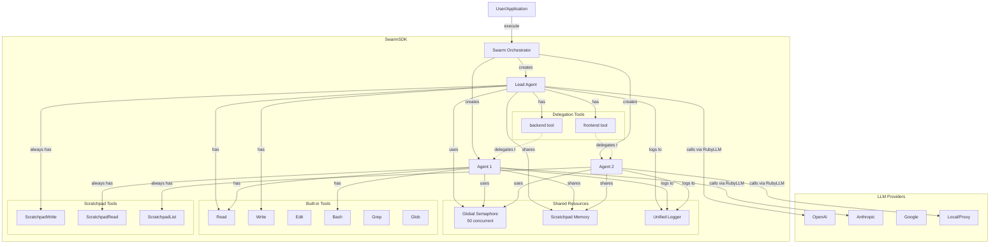

### Component Layers

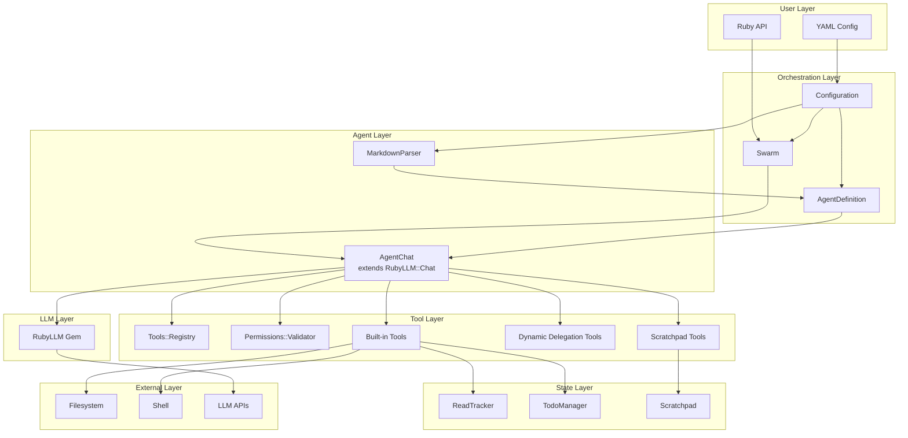

---

## Core Components

### 1. Swarm

**Purpose**: Main orchestrator that manages agents, execution, and shared resources.

**Location**: `lib/swarm_sdk/swarm.rb`

**Key Responsibilities**:
- Create and manage agent instances
- Coordinate shared resources (semaphores, scratchpad, logger)
- Execute tasks via lead agent
- Handle errors and return results

**Key Methods**:
```ruby
# Create swarm
swarm = Swarm.new(
  name: "My Swarm",
  global_concurrency: 50,
  default_local_concurrency: 10
)

# Add agents
swarm.add_agent(
  name: :backend,
  description: "Backend developer",
  model: "gpt-5",
  system_prompt: "You build APIs",
  tools: [:Read, :Write],
  delegates_to: [:database],
  directory: ".",
  base_url: nil,          # Custom API endpoint
  mcp_servers: [],        # MCP server configs
  parameters: {},         # LLM parameters (temperature, max_tokens, etc.)
  timeout: 300,           # HTTP timeout in seconds
  max_concurrent_tools: 10  # Override default
)

# Set lead
swarm.lead = :backend

# Execute
result = swarm.execute("Build API") do |log_entry|
  # Optional streaming callback
end

# Access agents
agent = swarm.agent(:backend)
```

**Lazy Initialization**:
Agents are initialized lazily on first `execute()` call to avoid unnecessary setup.

### 2. AgentChat

**Purpose**: Extended RubyLLM::Chat with parallel tool execution and rate limiting.

**Location**: `lib/swarm_sdk/agent_chat.rb`

**Key Features**:
- Extends `RubyLLM::Chat` with parallel tool calling
- Two-level semaphore system (global + local)
- Custom base_url and timeout support
- Provider detection for proxy compatibility

**Parallel Tool Execution**:
```ruby
# Standard RubyLLM: Sequential execution
response.tool_calls.each do |tool_call|
  result = execute_tool(tool_call)
end

# AgentChat: Parallel execution with rate limiting
Async do
  tasks = response.tool_calls.map do |tool_call|
    Async do
      acquire_semaphores do  # Queue if limit reached
        execute_tool(tool_call)
      end
    end
  end
  tasks.map(&:wait)
end.wait
```

**Context Window Tracking**:
```ruby
# Get context limit (with priority fallbacks)
chat.context_limit
# Priority order:
# 1. Explicit context_window parameter (user override)
# 2. Real model info from RubyLLM registry (searched across all providers)
# 3. Model info from chat instance

# Track cumulative token usage
chat.cumulative_input_tokens    # Total input tokens (from latest response)
chat.cumulative_output_tokens   # Sum of all output tokens
chat.cumulative_total_tokens    # Input + output
chat.context_usage_percentage   # Percentage used (0.0 to 100.0)
chat.tokens_remaining           # Tokens left in context window

# Automatic context warnings at 80% and 90% thresholds
# Emitted via LogStream when crossing threshold (once per threshold)
# {
#   type: "context_limit_warning",
#   agent: :backend,
#   threshold: "80%",
#   current_usage: "85%",
#   tokens_used: 8500,
#   tokens_remaining: 1500,
#   context_limit: 10000
# }
```

**Model Lookup and Suggestions**:
```ruby
# When model not found in registry, suggests similar models
# Stores warning during initialization, emits via LogStream during setup_logging
# {
#   type: "model_lookup_warning",
#   agent: :backend,
#   model: "gpt-5-unknown",
#   error_message: "Model not found in registry",
#   suggestions: [
#     { id: "gpt-5", name: "GPT-5", context_window: 200000 },
#     { id: "gpt-5-turbo", name: "GPT-5 Turbo", context_window: 128000 }
#   ]
# }
```

**Rate Limiting**:
```ruby
# Global semaphore (shared across all agents)
global_semaphore = Async::Semaphore.new(50)

# Local semaphore (per agent)
chat = AgentChat.new(
  model: "gpt-5",
  global_semaphore: global_semaphore,
  max_concurrent_tools: 10
)

# Execution:
# - If 50 LLM calls in progress: wait for slot (global)
# - If agent has 10 tool calls running: wait for slot (local)
# - Otherwise: execute immediately
```

### 3. Configuration

**Purpose**: Parse and validate YAML configuration, convert to Ruby API.

**Location**: `lib/swarm_sdk/configuration.rb`

**Key Features**:
- YAML parsing with environment variable interpolation
- Version validation (requires `version: 2`)
- Circular dependency detection
- Converts to `Swarm` instance via `#to_swarm`

**Environment Variables**:
```yaml
swarm:
  agents:
    backend:
      model: ${MODEL_NAME:=gpt-5}  # Default: gpt-5
      base_url: ${API_BASE_URL}    # Required, no default
```

**Circular Dependency Detection**:
```yaml
# This will raise CircularDependencyError:
agents:
  a:
    delegates_to: [b]
  b:
    delegates_to: [a]
```

### 4. AgentDefinition

**Purpose**: Store agent configuration with validation and system prompt construction.

**Location**: `lib/swarm_sdk/agent_definition.rb`

**Validates**:
- Required fields: `description`, `system_prompt`
- Directory existence
- Tool configurations with permissions
- API version compatibility (only for OpenAI-compatible providers)

**Defaults**:
```ruby
DEFAULT_MODEL = "gpt-5"
DEFAULT_PROVIDER = "openai"
DEFAULT_TIMEOUT = 300  # 5 minutes
```

**Base System Prompt**:
```ruby
# Each agent gets a base system prompt from ERB template
# Location: lib/swarm_sdk/prompts/base_system_prompt.md.erb

# Template variables injected:
# - cwd: Agent's working directory (first directory or Dir.pwd)
# - platform: RUBY_PLATFORM (e.g., "arm64-darwin23")
# - os_version: uname -sr output (e.g., "Darwin 24.6.0")
# - date: Current date (e.g., "2025-10-08")

# Final system prompt structure:
# 1. Rendered base system prompt (with environment context)
# 2. Custom system prompt (appended if provided)
```

**TodoWrite Reminder System**:
```ruby
# AgentChat injects system reminders at strategic points:

# 1. BEFORE_FIRST_MESSAGE_REMINDER - Injected before first user message
#    Contains important instruction reminders about file creation,
#    documentation, and general behavior

# 2. AFTER_FIRST_MESSAGE_REMINDER - Injected after first user message
#    Reminds about todo list workflow:
#    - Analyze scope first
#    - Create COMPLETE todo list before starting work
#    - Execute tasks one by one

# 3. TODOWRITE_PERIODIC_REMINDER - Injected every 8 messages
#    Gentle reminder if TodoWrite hasn't been used recently
#    Suggests using it if relevant to current work

# Implementation in AgentChat#ask:
def ask(prompt, **options)
  is_first_message = messages.none? { |msg| msg.role == :user }

  if is_first_message
    add_message(role: :user, content: BEFORE_FIRST_MESSAGE_REMINDER)
    add_message(role: :user, content: prompt)
    add_message(role: :user, content: AFTER_FIRST_MESSAGE_REMINDER)
    complete(**options)
  else
    # Inject periodic reminder if 8+ messages since last TodoWrite
    if should_inject_todowrite_reminder?
      add_message(role: :user, content: TODOWRITE_PERIODIC_REMINDER)
    end
    super(prompt, **options)
  end
end
```

### 5. MarkdownParser

**Purpose**: Parse agent definitions from Markdown files.

**Location**: `lib/swarm_sdk/markdown_parser.rb`

**Format**:
```markdown
---
model: claude-sonnet-4
description: Backend developer
tools: [Read, Write, Edit]
directory: "./backend"
---

You are a backend developer specializing in APIs and databases.
Build scalable backend architecture.
```

**Parsing**:
```ruby
content = File.read("agents/backend.md")
agent_def = MarkdownParser.parse(content, :backend)
# => AgentDefinition instance
```

### 6. Tools::Registry

**Purpose**: Central registry of built-in tools.

**Location**: `lib/swarm_sdk/tools/registry.rb`

**Available Tools**:
```ruby
BUILTIN_TOOLS = {
  Read: :special,           # Agent context required
  Write: :special,          # Agent context required
  Edit: :special,           # Agent context required
  Bash: SwarmSDK::Tools::Bash,
  Grep: SwarmSDK::Tools::Grep,
  Glob: SwarmSDK::Tools::Glob,
  MultiEdit: :special,      # Agent context required
  TodoWrite: :special,      # Agent context required
  ScratchpadWrite: :special,  # Scratchpad instance required
  ScratchpadRead: :special,   # Scratchpad instance required
  ScratchpadList: :special    # Scratchpad instance required
}
```

**Special Tools**: Tools marked as `:special` require context and use factory methods.

### 7. LogStream & LogCollector

**Purpose**: Module-level logging system with structured events.

**Locations**:
- `lib/swarm_sdk/log_stream.rb` - Module-level singleton for emitting events
- `lib/swarm_sdk/log_collector.rb` - Manages subscriber callbacks

**Key Features**:
- **LogStream**: Fiber-safe event emission from any component
- **LogCollector**: Manages user-registered callbacks
- Distinguishes delegation vs tool calls via AgentContext
- Calculates costs using RubyLLM model registry
- Thread-safe and fiber-safe with freeze! mechanism

**Usage**:
```ruby
# Register callback before execution (in Swarm#execute)
LogCollector.on_log do |entry|
  puts entry.to_json  # Stream to stdout, file, database, etc.
end

# Freeze callbacks before Async execution for fiber safety
LogCollector.freeze!

# Emit events from anywhere in SDK
LogStream.emit(
  type: "user_request",
  agent: :backend,
  model: "claude-sonnet-4"
)

# LogStream forwards to LogCollector, which calls user callbacks
```

### 8. AgentContext

**Purpose**: Encapsulates per-agent state and metadata for logging and tracking.

**Location**: `lib/swarm_sdk/agent_context.rb`

**Key Features**:
- Tracks agent identity (name)
- Identifies which tool calls are delegations
- Tracks context window warning thresholds (80%, 90%)
- Stores optional metadata

**Usage**:
```ruby
# Created automatically during agent initialization
context = AgentContext.new(
  name: :backend,
  delegation_tools: ["DelegateTaskToDatabase", "DelegateTaskToAuth"],
  metadata: { role: "backend" }
)

# Track a delegation
context.track_delegation(call_id: "call_123", target: "DelegateTaskToDatabase")

# Check if a tool call is a delegation
context.delegation?(call_id: "call_123")  # => true

# Check if a tool name is a delegation tool
context.delegation_tool?("DelegateTaskToDatabase")  # => true

# Track context warnings (prevents duplicate warnings)
context.hit_warning_threshold?(80)  # => true (first time)
context.hit_warning_threshold?(80)  # => false (already warned)
```

**Context Warning Thresholds**:
```ruby
# Defined in AgentContext
CONTEXT_WARNING_THRESHOLDS = [80, 90].freeze

# When context usage crosses a threshold, emit warning once
if context_usage_percentage >= 80 && !context.warning_threshold_hit?(80)
  context.hit_warning_threshold?(80)
  LogStream.emit(
    type: "context_limit_warning",
    agent: :backend,
    threshold: "80%",
    current_usage: "85%"
  )
end
```

### 9. ReadTracker

**Purpose**: Track which files each agent has read.

**Location**: `lib/swarm_sdk/tools/read_tracker.rb`

**Key Features**:
- Path-based hierarchical storage
- Size limits (1MB per entry, 100MB total)
- Metadata (title, timestamp, size)
- Shared across all agents in swarm

**Usage**:
```ruby
scratchpad = Scratchpad.new

# Write
scratchpad.write(
  file_path: "analysis/report",
  content: "Detailed analysis...",
  title: "Performance Analysis"
)

# Read
content = scratchpad.read(file_path: "analysis/report")

# List
entries = scratchpad.list(prefix: "analysis/")
# => [{ path: "analysis/report", title: "...", size: 1024, created_at: ... }]
```

### 10. Scratchpad

**Purpose**: Session-scoped, in-memory storage for agents.

**Location**: `lib/swarm_sdk/scratchpad.rb`

**Key Features**:
- Path-based hierarchical storage
- Size limits (1MB per entry, 100MB total)
- Metadata (title, timestamp, size)
- Shared across all agents in swarm

**Usage**:
```ruby
scratchpad = Scratchpad.new

# Write
scratchpad.write(
  file_path: "analysis/report",
  content: "Detailed analysis...",
  title: "Performance Analysis"
)

# Read
content = scratchpad.read(file_path: "analysis/report")

# List
entries = scratchpad.list(prefix: "analysis/")
# => [{ path: "analysis/report", title: "...", size: 1024, created_at: ... }]
```

### 11. ReadTracker

**Purpose**: Track which files each agent has read.

**Location**: `lib/swarm_sdk/tools/read_tracker.rb`

**Key Features**:
- Global registry per agent
- Thread-safe with Mutex
- Enforces read-before-write/edit rules

**Usage**:
```ruby
# Register read
ReadTracker.register_read(:backend, "/path/to/file.rb")

# Check if read
ReadTracker.file_read?(:backend, "/path/to/file.rb")
# => true

# Different agent hasn't read it
ReadTracker.file_read?(:frontend, "/path/to/file.rb")
# => false
```

### 13. TodoManager

**Purpose**: Per-agent todo list storage.

**Location**: `lib/swarm_sdk/tools/todo_manager.rb`

**Key Features**:
- Independent lists per agent
- Thread-safe with Mutex
- Validates todo structure

**Usage**:
```ruby
# Set todos
TodoManager.set_todos(:backend, [
  { content: "Build API", status: "in_progress", activeForm: "Building API" },
  { content: "Write tests", status: "pending", activeForm: "Writing tests" }
])

# Get todos
todos = TodoManager.get_todos(:backend)

# Clear
TodoManager.clear_todos(:backend)
```

### 15. Permissions::Config

**Purpose**: Parse and validate permission rules.

**Location**: `lib/swarm_sdk/permissions/config.rb`

**Key Features**:
- Glob pattern matching
- Allowlist + denylist
- Relative path expansion

**Usage**:
```ruby
permissions = Permissions::Config.new(
  {
    allowed_paths: ["backend/**/*", "lib/**/*.rb"],
    denied_paths: ["backend/secrets/**"]
  },
  base_directory: "/home/user/project"
)

permissions.allowed?("backend/api.rb")           # => true
permissions.allowed?("backend/secrets/key.pem")  # => false
permissions.allowed?("frontend/app.js")          # => false
```

### 17. Permissions::Validator

**Purpose**: Decorator that wraps tools to enforce permissions.

**Location**: `lib/swarm_sdk/permissions/validator.rb`

**Usage**:
```ruby
write_tool = Tools::Write.create_for_agent(:backend)
permissions = Permissions::Config.new(
  { allowed_paths: ["backend/**/*"] },
  base_directory: "."
)

validated_tool = Permissions::Validator.new(write_tool, permissions)

# This will be denied:
result = validated_tool.call({
  "file_path" => "frontend/app.js",
  "content" => "..."
})
# => "Permission denied: Cannot access 'frontend/app.js'"
```

### 19. Result

**Purpose**: Encapsulate execution results with metadata.

**Location**: `lib/swarm_sdk/result.rb`

**Fields**:
```ruby
result = Result.new(
  content: "API created successfully",
  agent: "backend",
  cost: 0.15,
  tokens: { input: 1500, output: 300 },
  duration: 5.2,
  logs: [...],
  error: nil,
  metadata: {}
)

# Query methods
result.success?           # => true
result.failure?           # => false
result.total_cost         # => 0.15 (aggregated from logs)
result.total_tokens       # => 1800 (aggregated from logs)
result.agents_involved    # => [:architect, :backend]
result.llm_requests       # => 5
result.tool_calls_count   # => 12
```

---

## Configuration Format

### Version 2 YAML Structure

```yaml
version: 2  # Required

swarm:
  name: "Development Team"
  lead: architect  # Required: entry point agent

  # Optional: Settings applied to all agents
  all_agents:
    # Tools added to ALL agents (in addition to built-in defaults)
    tools:
      - Write
      - Edit

    # Optional: Disable built-in default tools for all agents
    # Built-in defaults: Read, Grep, Glob, TodoWrite, ScratchpadWrite/Read/List
    include_default_tools: true  # default: true

    # Optional: Permissions applied to all agents
    permissions:
      Read:
        allowed_paths: ["**/*"]
        denied_paths: ["secrets/**", ".env"]
      Write:
        allowed_paths: ["src/**/*", "lib/**/*"]
        denied_paths: ["src/generated/**"]

  agents:
    architect:
      description: "Lead architect coordinating the team"
      model: gpt-5
      provider: openai  # Optional: default is openai
      system_prompt: |
        You are the lead architect.
        Coordinate work between teams.

      # Tools (optional)
      tools:
        - Read
        - Edit
        - Bash

      # Delegation (optional)
      delegates_to:
        - backend
        - frontend

      # Working directories (optional, default: ["."])
      directories:
        - "."

      # LLM parameters (optional)
      parameters:
        temperature: 0.7
        max_tokens: 4000
        reasoning_effort: high  # For o1/o3 models

      # HTTP timeout (optional, default: 300)
      timeout: 600  # 10 minutes for reasoning models

      # Custom API endpoint (optional)
      base_url: https://api.openai.com/v1

      # API endpoint version (optional, for OpenAI-compatible providers)
      # Use "v1/responses" for models requiring the Responses API
      # Use "v1/chat/completions" (default) for standard chat models
      api_version: "v1/responses"

      # MCP servers (optional)
      mcp_servers:
        - type: stdio
          command: npx
          args: ["-y", "@modelcontextprotocol/server-filesystem"]

      # Permissions (optional, overrides defaults)
      permissions:
        Write:
          allowed_paths: ["docs/**"]

    backend:
      # Load from Markdown file
      agent_file: "agents/backend.md"
      tools: [Read, Write, Edit, Bash]
      directory: "./backend"

      # Inline permissions for specific tools
      tools:
        - Read
        - Write:
            allowed_paths: ["backend/**/*"]
            denied_paths: ["backend/node_modules/**"]
        - Edit

      # Bypass permissions (dangerous, use carefully)
      bypass_permissions: false  # Default: false

    frontend:
      agent_file: "agents/frontend.md"
      tools: [Read, Write, Edit]
      directory: "./frontend"
      model: claude-sonnet-4
      provider: anthropic
      base_url: https://api.anthropic.com
```

### Markdown Agent Files

```markdown
---
model: claude-sonnet-4
description: Backend developer specializing in APIs
tools: [Read, Write, Edit, Bash, Grep, Glob]
directory: "./backend"
parameters:
  temperature: 0.5
  max_tokens: 8000
---

# Backend Developer System Prompt

You are a backend developer specializing in APIs and databases.

## Your Expertise
- RESTful API design
- Database schema design
- Authentication and authorization
- Performance optimization

## Guidelines
- Write clean, testable code
- Follow SOLID principles
- Use async patterns where appropriate
- Document your code
```

### Environment Variable Interpolation

```yaml
swarm:
  agents:
    backend:
      model: ${MODEL_NAME:=gpt-5}           # Default: gpt-5
      base_url: ${API_BASE_URL}             # Required, no default
      parameters:
        temperature: ${TEMPERATURE:=0.7}    # Default: 0.7
```

```bash
export MODEL_NAME="claude-sonnet-4"
export API_BASE_URL="https://custom.proxy/v1"
ruby script.rb
```

### Permission Patterns

```yaml
all_agents:
  permissions:
    Read:
      # Allowlist: Only these paths allowed
      allowed_paths:
        - "src/**/*"           # All files under src/
        - "lib/**/*.rb"        # Ruby files under lib/
        - "config/*.yml"       # YAML files in config/
        - "**/README.md"       # README files anywhere

      # Denylist: Explicit denials (takes precedence)
      denied_paths:
        - "**/.env*"           # Environment files
        - "**/*secret*"        # Files with "secret" in name
        - "**/*.key"           # Key files
        - "node_modules/**"    # Dependencies
        - ".git/**"            # Git internals

    Write:
      allowed_paths:
        - "src/**/*"
        - "test/**/*"
      denied_paths:
        - "src/generated/**"   # Generated code
        - "**/vendor/**"       # Vendor code
```

---

## Agent Lifecycle

### 1. Creation (Ruby API)

```ruby
swarm = Swarm.new(name: "My Swarm")

swarm.add_agent(
  name: :backend,
  description: "Backend developer",
  model: "gpt-5",
  system_prompt: "You build APIs",
  tools: [:Read, :Write],
  delegates_to: [:database]
)

swarm.lead = :backend
```

### 2. Lazy Initialization

Agents are initialized lazily on first `execute()`:

```ruby
# No agents created yet
result = swarm.execute("Build API")  # Triggers initialization
```

**Initialization Steps**:

1. **First Pass**: Create `AgentChat` instances for all agents
2. **Second Pass**: Register delegation tools based on `delegates_to`
3. **Third Pass**: Attach logger to all agents (if streaming enabled)

```ruby
# lib/swarm_sdk/swarm.rb:294
def initialize_agents
  # Pass 1: Create all agent chat instances
  @agent_definitions.each do |name, definition|
    chat = create_agent_chat(name, definition)
    @agents[name] = chat
  end

  # Pass 2: Register delegation tools
  @agent_definitions.each do |name, definition|
    register_agent_tools(@agents[name], definition[:delegates_to])
  end

  # Pass 3: Attach logger
  if @logger
    @agents.each do |agent_name, chat|
      @logger.attach_to_chat(chat, agent_name: agent_name, ...)
    end
  end

  @agents_initialized = true
end
```

### 3. Tool Registration

Each agent gets tools in this order:

**1. Default Tools** (if `include_default_tools: true`, which is default):
```ruby
# Built-in defaults automatically available:
- Read
- Grep
- Glob
- TodoWrite
- ScratchpadWrite
- ScratchpadRead
- ScratchpadList
```

**2. All Agents Tools** (from `all_agents.tools` in YAML):
```yaml
all_agents:
  tools: [Write, Edit]  # Added to ALL agents
```

**3. Agent-Specific Tools** (from `agent.tools`):
```yaml
agents:
  backend:
    tools: [Bash]  # Gets: defaults + all_agents tools + Bash
```

**4. Delegation Tools** (dynamic, based on `delegates_to`):
```ruby
delegates_to: [:backend, :frontend]
# => Creates "backend" and "frontend" tools that call those agents
```

**Disabling Defaults:**
```yaml
agents:
  minimal:
    tools: [Bash]
    include_default_tools: false  # Only gets all_agents tools + Bash
```

### 4. Execution

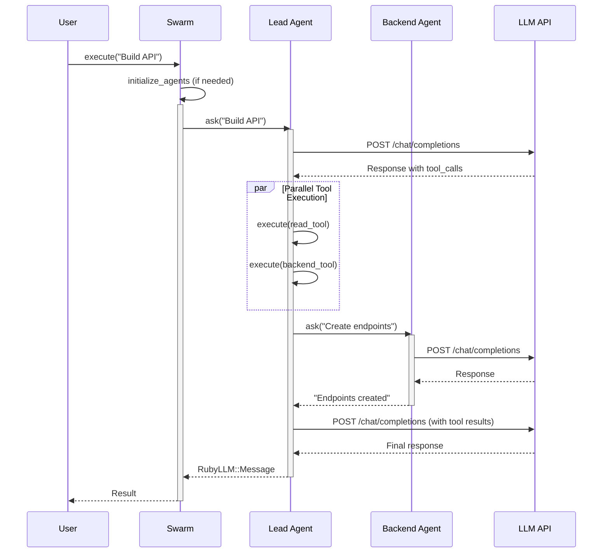

### 5. Agent Types

**Singleton Agents** (default):
- Created once during initialization
- Maintain conversation history
- Used for persistent delegation

```ruby
delegates_to: [:backend]
# backend tool always calls same backend agent instance
```

---

## Tool Calling System

### Tool Architecture

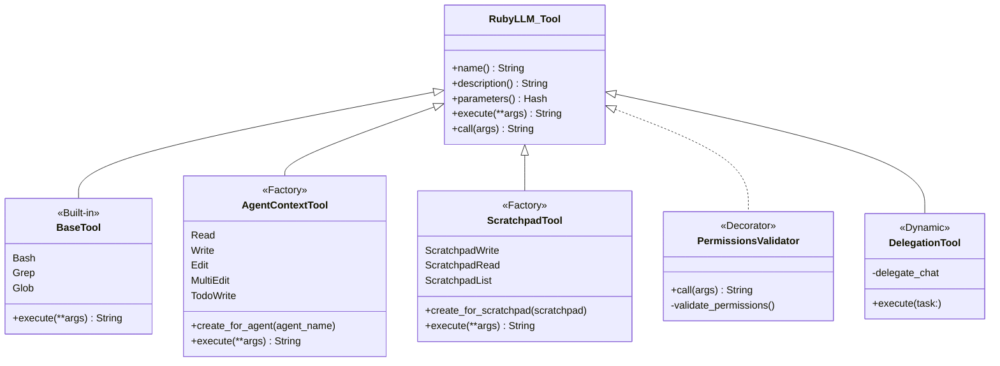

### Tool Categories

#### 1. Standard Tools (Stateless)

**Bash**, **Grep**, **Glob**

```ruby
class Bash < RubyLLM::Tool
  description "Executes bash commands..."

  param :command, type: "string", required: true
  param :timeout, type: "integer", required: false

  def execute(command:, timeout: nil)
    # Execute and return output
  end
end

# Registration
Tools::Registry::BUILTIN_TOOLS = {
  Bash: SwarmSDK::Tools::Bash
}

# Usage
chat.with_tool(Tools::Bash.new)
```

**Path Validation**: Tools that accept a `path` or `file_path` parameter enforce validation:

```ruby
# Grep and Glob require non-nil, non-blank path
grep_tool.execute(pattern: "TODO", path: ".")       # ✅ Valid
grep_tool.execute(pattern: "TODO", path: nil)       # ❌ Error: path is required
grep_tool.execute(pattern: "TODO", path: "   ")     # ❌ Error: path is required

# Read, Write, Edit, MultiEdit require non-nil, non-blank file_path
read_tool.execute(file_path: "test.rb")             # ✅ Valid
read_tool.execute(file_path: nil)                   # ❌ Error: file_path is required
read_tool.execute(file_path: "")                    # ❌ Error: file_path is required

# Scratchpad tools require non-nil, non-blank file_path
scratchpad_write.execute(
  file_path: "report",
  content: "...",
  title: "Report"
)  # ✅ Valid

scratchpad_write.execute(
  file_path: "   ",
  content: "...",
  title: "Report"
)  # ❌ Error: file_path is required
```

#### 2. Agent-Context Tools (Stateful)

**Read**, **Write**, **Edit**, **MultiEdit**, **TodoWrite**

These tools need agent context for state tracking.

```ruby
# Factory pattern
module Tools
  module Read
    def self.create_for_agent(agent_name)
      tool_class = Class.new(RubyLLM::Tool) do
        @agent_name = agent_name.to_sym

        define_method(:execute) do |file_path:|
          agent_id = self.class.agent_name
          ReadTracker.register_read(agent_id, file_path)
          # ... read file
        end
      end

      tool_class.new
    end
  end
end

# Usage
read_tool = Tools::Read.create_for_agent(:backend)
chat.with_tool(read_tool)
```

**Why?** Each agent needs independent read tracking for read-before-write enforcement.

#### 3. Scratchpad Tools (Shared)

**ScratchpadWrite**, **ScratchpadRead**, **ScratchpadList**

These tools share a scratchpad instance across all agents.

```ruby
class ScratchpadWrite < RubyLLM::Tool
  def self.create_for_scratchpad(scratchpad)
    tool = new
    tool.instance_variable_set(:@scratchpad, scratchpad)
    tool
  end

  def execute(file_path:, content:, title:)
    @scratchpad.write(file_path: file_path, content: content, title: title)
  end
end

# Usage
scratchpad = Scratchpad.new
tool = ScratchpadWrite.create_for_scratchpad(scratchpad)
chat.with_tool(tool)
```

#### 4. Dynamic Delegation Tools

**Created at runtime based on `delegates_to`**

```ruby
# Configuration
swarm.add_agent(
  name: :architect,
  delegates_to: [:backend, :frontend]
)

# Creates tools dynamically:
# - "backend" tool that calls backend agent
# - "frontend" tool that calls frontend agent

tool_class = Class.new(RubyLLM::Tool) do
  description("Delegate tasks to backend. Backend developer")

  param :task,
    type: "string",
    desc: "Task description for the agent",
    required: true

  define_method(:execute) do |task:|
    response = delegate_chat.ask(task)
    response.content
  end
end
```

### Tool Permissions

Tools can be wrapped with `Permissions::Validator`:

```ruby
# Create tool
write_tool = Tools::Write.create_for_agent(:backend)

# Configure permissions
permissions = Permissions::Config.new(
  { allowed_paths: ["backend/**/*"] },
  base_directory: "."
)

# Wrap with validator (decorator pattern)
validated_tool = Permissions::Validator.new(write_tool, permissions)

# Register validated tool
chat.with_tool(validated_tool)
```

### Tool Registration Flow

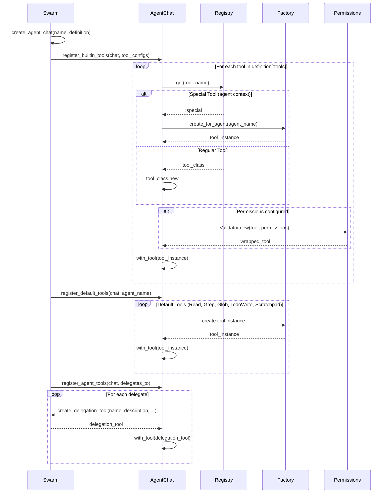

### Read-Before-Write Enforcement

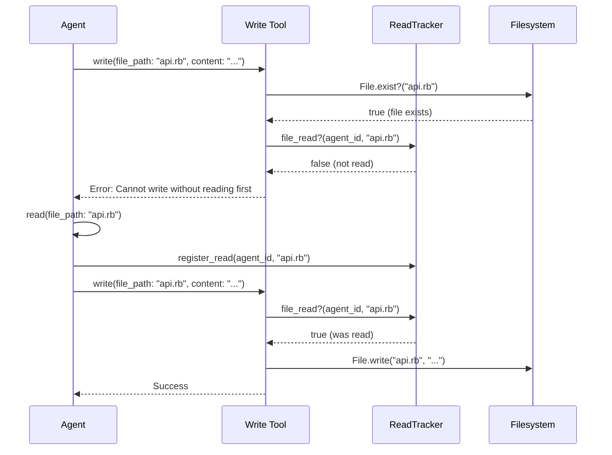

---

## Delegation System

### Overview

Delegation allows agents to call other agents as tools. This is SwarmSDK's core collaboration mechanism.

### Configuration

```ruby
swarm.add_agent(
  name: :architect,
  description: "Lead architect",
  delegates_to: [:backend, :frontend]
)

swarm.add_agent(
  name: :backend,
  description: "Backend developer"
)

swarm.add_agent(
  name: :frontend,
  description: "Frontend developer"
)
```

This creates:
- `backend` tool on architect agent
- `frontend` tool on architect agent

### Delegation Tool Usage

```ruby
# Delegate a task to backend agent
backend_tool.execute(task: "Build authentication API")
# Uses persistent backend agent instance (maintains conversation history)
```

**Use Cases**:
- Sequential tasks requiring context
- Follow-up questions
- Iterative development
- All agent-to-agent communication

### Delegation Tool Creation

```ruby
# lib/swarm_sdk/swarm.rb
def create_delegation_tool(name:, description:, delegate_chat:, agent_name:)
  tool_class = Class.new(RubyLLM::Tool) do
    description("Delegate tasks to #{name}. #{description}")

    param :task,
      type: "string",
      desc: "Task description for the agent",
      required: true

    @delegate_chat = delegate_chat
    @tool_name = "DelegateTaskTo#{name.capitalize}"
    @agent_name = agent_name

    define_method(:execute) do |task:|
      response = self.class.delegate_chat.ask(task)
      response.content
    rescue Faraday::TimeoutError, Net::ReadTimeout => e
      # Log timeout error as JSON event
      LogStream.emit(
        type: "delegation_error",
        agent: self.class.agent_name,
        delegate_to: self.class.tool_name,
        error_class: e.class.name,
        error_message: "Request timed out"
      )
      "Error: Request to #{self.class.tool_name} timed out. " \
        "The agent may be overloaded or the LLM service is not responding."
    rescue Faraday::Error => e
      # Log network error as JSON event
      LogStream.emit(
        type: "delegation_error",
        agent: self.class.agent_name,
        delegate_to: self.class.tool_name,
        error_class: e.class.name,
        error_message: e.message
      )
      "Error: Network error communicating with #{self.class.tool_name}: " \
        "#{e.class.name}. Please check connectivity and try again."
    rescue StandardError => e
      # Log unexpected error as JSON event with backtrace
      LogStream.emit(
        type: "delegation_error",
        agent: self.class.agent_name,
        delegate_to: self.class.tool_name,
        error_class: e.class.name,
        error_message: e.message,
        backtrace: e.backtrace&.first(5) || []
      )
      # Return error string for LLM
      "Error: #{self.class.tool_name} encountered an error: " \
        "#{e.class.name}: #{e.message}"
    end
  end

  tool_class.new
end
```

### MCP Integration

SwarmSDK provides full support for external MCP servers, allowing agents to access tools from MCP-compliant servers.

**Supported Transports**:
- **stdio**: Standard input/output (e.g., command-line tools)
- **sse**: Server-Sent Events (HTTP streaming)
- **streamable** (HTTP): Standard HTTP with streaming support

**Configuration**:
```yaml
agents:
  backend:
    mcp_servers:
      # stdio transport - runs a command
      - name: filesystem-mcp
        type: stdio
        command: npx
        args: ["-y", "@modelcontextprotocol/server-filesystem"]
        env:
          ALLOWED_PATHS: "/tmp,/var/data"
        timeout: 30  # seconds

      # SSE transport - connects to HTTP endpoint
      - name: search-mcp
        type: sse
        url: "https://mcp-server.example.com/sse"
        headers:
          Authorization: "Bearer ${MCP_TOKEN}"
        version: http2  # http2 or http11

      # Streamable transport - HTTP with streaming
      - name: database-mcp
        type: streamable  # or 'http'
        url: "https://db-mcp.example.com/v1"
        headers:
          API-Key: "${DB_API_KEY}"
        oauth:
          token_url: "https://auth.example.com/token"
          client_id: "${CLIENT_ID}"
        rate_limit:
          requests_per_minute: 60
```

**Automatic Cleanup**:
```ruby
# MCP clients are automatically cleaned up after swarm execution
# In Swarm#cleanup (called in ensure block):
@mcp_clients.each do |agent_name, clients|
  clients.each do |client|
    client.stop if client.alive?  # Gracefully stop MCP client
  end
end
```

**Tool Registration**:
```ruby
# MCP server tools are registered automatically with agent's chat
# lib/swarm_sdk/swarm.rb:register_mcp_servers
client = RubyLLM::MCP.client(
  name: server_config[:name],
  transport_type: :stdio,  # or :sse, :streamable
  request_timeout: timeout_ms,
  config: transport_config
)

# Fetch tools from MCP server (already in RubyLLM::Tool format)
tools = client.tools
tools.each { |tool| chat.with_tool(tool) }
```

---

## Concurrency Model

### Architecture

SwarmSDK uses **Fiber-based concurrency** with the Async gem and **two-level rate limiting**.

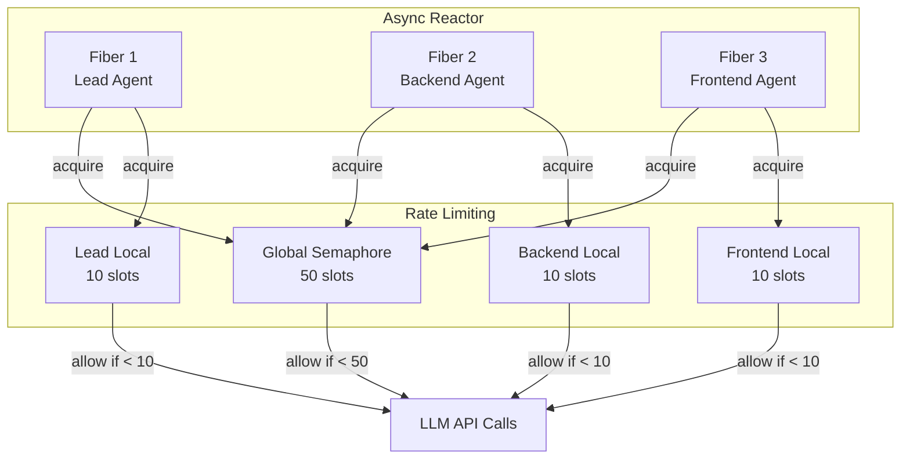

### Why Two-Level Rate Limiting?

**Problem**: Unlimited parallelism in hierarchical agent trees causes exponential growth:

```
Main → 10 agents → 100 agents → 1,000 agents = API meltdown!
```

**Solution**: Two semaphore levels:

1. **Global Semaphore**: Max concurrent LLM calls across entire swarm (default: 50)
2. **Local Semaphore**: Max concurrent tool calls per agent (default: 10)

### Example Scenario

```ruby
swarm = Swarm.new(
  name: "Team",
  global_concurrency: 50,        # Swarm-wide limit
  default_local_concurrency: 10  # Per-agent limit
)

# Architect agent
swarm.add_agent(
  name: :architect,
  delegates_to: [:backend, :frontend, :database],  # Can call 3 agents
  max_concurrent_tools: 15  # Override: can make 15 concurrent tool calls
)
```

**Execution**:

1. Architect makes LLM call
   - **Global**: 1/50 slots used ✅
   - **Local**: N/A (not a tool call)

2. Architect calls 20 tools in parallel (10 delegation + 10 file operations)
   - **Global**: 21/50 slots used (1 for architect + 20 for tools) ✅
   - **Local**: 15 execute immediately, 5 queue (local limit: 15)
   - When a tool completes, next queued tool executes

3. Each delegated agent makes calls
   - **Global**: Queues if 50 total slots reached
   - **Local**: Each agent has own 10-slot limit

### Parallel Tool Execution

```ruby
# lib/swarm_sdk/agent_chat.rb:103
def handle_tool_calls(response, &block)
  # Single tool: use default sequential execution
  return super if response.tool_calls.size == 1

  # Multiple tools: execute in parallel with rate limiting
  results = Async do
    tasks = response.tool_calls.map do |_id, tool_call|
      Async do
        # Acquire semaphores (queues if limit reached)
        acquire_semaphores do
          @on[:tool_call]&.call(tool_call)

          # Execute tool - Faraday yields during HTTP I/O
          result = execute_tool(tool_call)

          @on[:tool_result]&.call(result)

          # Add tool result to conversation
          add_message(role: :tool, content: result, tool_call_id: tool_call.id)

          { tool_call: tool_call, result: result }
        end
      end
    end

    # Wait for all tasks to complete
    tasks.map(&:wait)
  end.wait

  # Continue automatic loop
  complete(&block)
end
```

### Semaphore Acquisition

```ruby
# lib/swarm_sdk/agent_chat.rb:158
def acquire_semaphores(&block)
  if @global_semaphore && @local_semaphore
    # Both limits: acquire global first, then local
    @global_semaphore.acquire do
      @local_semaphore.acquire(&block)
    end
  elsif @global_semaphore
    # Only global limit
    @global_semaphore.acquire(&block)
  elsif @local_semaphore
    # Only local limit
    @local_semaphore.acquire(&block)
  else
    # No limits: execute immediately
    yield
  end
end
```

### Async Reactor

SwarmSDK uses `Async` reactor for fiber scheduling:

```ruby
# lib/swarm_sdk/swarm.rb:198
response = Async(finished: false) do
  lead.ask(prompt)
end.wait
```

**Key Features**:
- `finished: false`: Suppress warnings for expected task failures
- Faraday HTTP client yields during I/O, allowing other fibers to run
- No thread overhead, lightweight fiber switching

### Performance Characteristics

| Scenario | Sequential (v1) | Parallel (v2) |
|----------|----------------|---------------|
| 1 agent, 10 tools | 10s (1s each) | 10s (parallelized) |
| 1 agent, 10 parallel tools | 10s | 1s (all at once) |
| 10 agents, 1 tool each | 10s | 1s (all at once) |
| 10 agents, 10 tools each | 100s | ~10s (constrained by limits) |
| Deep delegation (5 levels) | 5x baseline | ~2x baseline (limited parallelism) |

---

## Permissions System

### Overview

Fine-grained file access control using **glob patterns** and **allowlist + denylist**.

### Architecture

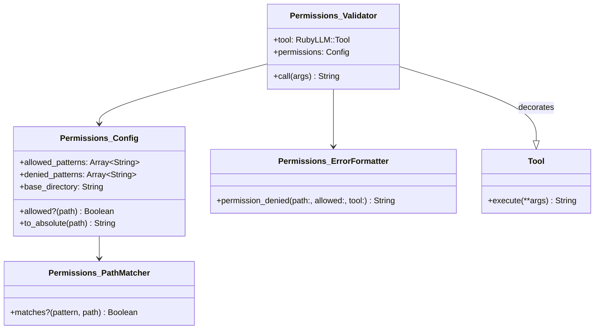

### Configuration

#### YAML Configuration

```yaml
swarm:
  # Settings applied to all agents
  all_agents:
    permissions:
      Read:
        allowed_paths:
          - "**/*"              # Allow all files
        denied_paths:
          - "secrets/**"        # Deny secrets directory
          - "**/.env*"          # Deny environment files
          - "**/*.key"          # Deny key files

      Write:
        allowed_paths:
          - "src/**/*"          # Only src directory
          - "lib/**/*.rb"       # Ruby files in lib
        denied_paths:
          - "src/generated/**"  # Not generated code

  agents:
    backend:
      # Agent-specific permissions override defaults
      permissions:
        Write:
          allowed_paths: ["backend/**/*"]
          denied_paths: ["backend/node_modules/**"]

      # Inline tool permissions (most specific)
      tools:
        - Read
        - Write:
            allowed_paths: ["backend/src/**"]
        - Edit
```

#### Ruby API Configuration

```ruby
swarm.add_agent(
  name: :backend,
  tools: [
    :Read,
    { Write: { allowed_paths: ["backend/**/*"] } },
    :Edit
  ],
  directory: "./backend"
)
```

### Permission Rules

1. **Denied takes precedence**: If a path matches denied pattern, always block
2. **Allowlist behavior**: If `allowed_paths` specified, path must match at least one
3. **No allowlist**: Allow everything except denied
4. **Relative paths**: Converted to absolute based on agent's `directories[0]`

### Glob Patterns

Supports standard glob patterns:

| Pattern | Matches | Example |
|---------|---------|---------|
| `*` | Any characters except `/` | `*.rb` matches `foo.rb` |
| `**` | Any characters including `/` | `**/*.rb` matches `a/b/c.rb` |
| `?` | Single character | `file?.rb` matches `file1.rb` |
| `[abc]` | Character set | `file[123].rb` matches `file1.rb` |
| `{a,b}` | Alternatives | `*.{rb,js}` matches `foo.rb`, `bar.js` |

### Path Resolution

All paths are converted to absolute:

```ruby
# Agent configuration
directory: "/home/user/project/backend"

# Permission patterns
allowed_paths: ["src/**/*", "/tmp/**"]

# Resolved patterns (expanded relative to directories[0])
allowed_patterns: [
  "/home/user/project/backend/src/**/*",  # Relative expanded
  "/tmp/**"                                # Absolute kept as-is
]

# File access
tool.call({ "file_path" => "src/api.rb" })
# => Absolute: /home/user/project/backend/src/api.rb
# => Matches: /home/user/project/backend/src/**/*
# => Allowed ✅

tool.call({ "file_path" => "/tmp/cache.txt" })
# => Absolute: /tmp/cache.txt
# => Matches: /tmp/**
# => Allowed ✅

tool.call({ "file_path" => "../../secrets/key.pem" })
# => Absolute: /home/user/secrets/key.pem
# => No match
# => Denied ❌
```

### Directory Search Tools

Glob and Grep operate on directories. Special handling:

```ruby
# Grep/Glob configuration
permissions = Config.new(
  { allowed_paths: ["backend/src/**/*"] },
  base_directory: "/project"
)

# Directory search
grep_tool.call({ "path" => "backend", "pattern" => "TODO" })

# Check: Is "backend" allowed as search base?
# YES if any allowed pattern starts with "backend/"
# /project/backend/src/**/* starts with /project/backend/
# => Allowed ✅

# Results are filtered to allowed paths
# Found: backend/src/api.rb ✅
# Found: backend/node_modules/pkg/index.js ❌ (if denied)
```

### Bypass Permissions

**Dangerous**: Completely disable permission checks for an agent.

```yaml
agents:
  admin:
    bypass_permissions: true  # ⚠️ Use with extreme caution
```

```ruby
swarm.add_agent(name: :admin, ...)
swarm.set_bypass_permissions(:admin, true)
```

**Use Cases**:
- Trusted administrative agents
- Testing and development
- System-level operations

---

## OpenAI Responses API Support

### Overview

SwarmSDK includes full support for OpenAI's **Responses API** (`v1/responses`), which is required by certain models like `gpt-5-pro` and useful for advanced features like reasoning tokens.

### Configuration

Use the `api_version` parameter to specify which endpoint to use:

```yaml
agents:
  researcher:
    model: gpt-5-pro
    provider: openai
    base_url: "https://api.openai.com/v1"
    api_version: "v1/responses"  # Use Responses API
    system_prompt: "You are a research analyst"
```

```ruby
swarm.add_agent(
  name: :researcher,
  model: "gpt-5-pro",
  provider: :openai,
  base_url: "https://api.openai.com/v1",
  api_version: "v1/responses",
  system_prompt: "You are a research analyst"
)
```

### How It Works

SwarmSDK automatically uses a custom provider (`OpenAIWithResponses`) that handles the Responses API's different format:

**Request Differences**:
- Uses `input` instead of `messages` parameter
- Tools use flat format: `{type: "function", name: "...", parameters: {...}}`
- Multi-turn uses `previous_response_id` + `function_call_output` items

**Response Differences**:
- Returns `output` array instead of `choices[0].message`
- Output items have different types: `reasoning`, `function_call`, `message`
- Message content is in `content[].output_text` format

### Multi-Turn Conversations

The custom provider maintains conversation state using response IDs:

```ruby
# First turn
POST /v1/responses
{
  "model": "gpt-5-pro",
  "input": [{"role": "user", "content": "List files"}],
  "tools": [...]
}

# Response includes response ID
{
  "id": "resp_abc123",
  "output": [
    {
      "type": "function_call",
      "call_id": "call_xyz",
      "name": "glob",
      "arguments": "{\"pattern\":\"*\",\"path\":\".\"}"
    }
  ]
}

# Second turn (after executing tool)
POST /v1/responses
{
  "model": "gpt-5-pro",
  "previous_response_id": "resp_abc123",  # Reference previous response
  "input": [
    {
      "type": "function_call_output",
      "call_id": "call_xyz",
      "output": "file1.txt\nfile2.txt"
    }
  ],
  "tools": [...]
}
```

### Supported Models

Any OpenAI-compatible model that requires the Responses API. Examples:
- `gpt-5-pro`
- `gpt-5`

### Implementation Details

**Location**: `lib/swarm_sdk/providers/openai_with_responses.rb`

**Key Methods**:
- `render_payload` - Transforms request from `messages` to `input` format
- `parse_completion_response` - Parses `output` array to extract content and tool calls
- `format_input_messages` - Filters and formats messages for Responses API
- `format_new_input_messages` - Formats tool results as `function_call_output` items

**Automatic Selection**:
When you set `api_version: "v1/responses"`, SwarmSDK automatically:
1. Uses `OpenAIWithResponses` provider instead of standard OpenAI provider
2. Tracks response IDs for multi-turn conversations
3. Transforms requests and responses to match Responses API format
4. Handles tool calling with `function_call_output` format

### Permission Validation Flow

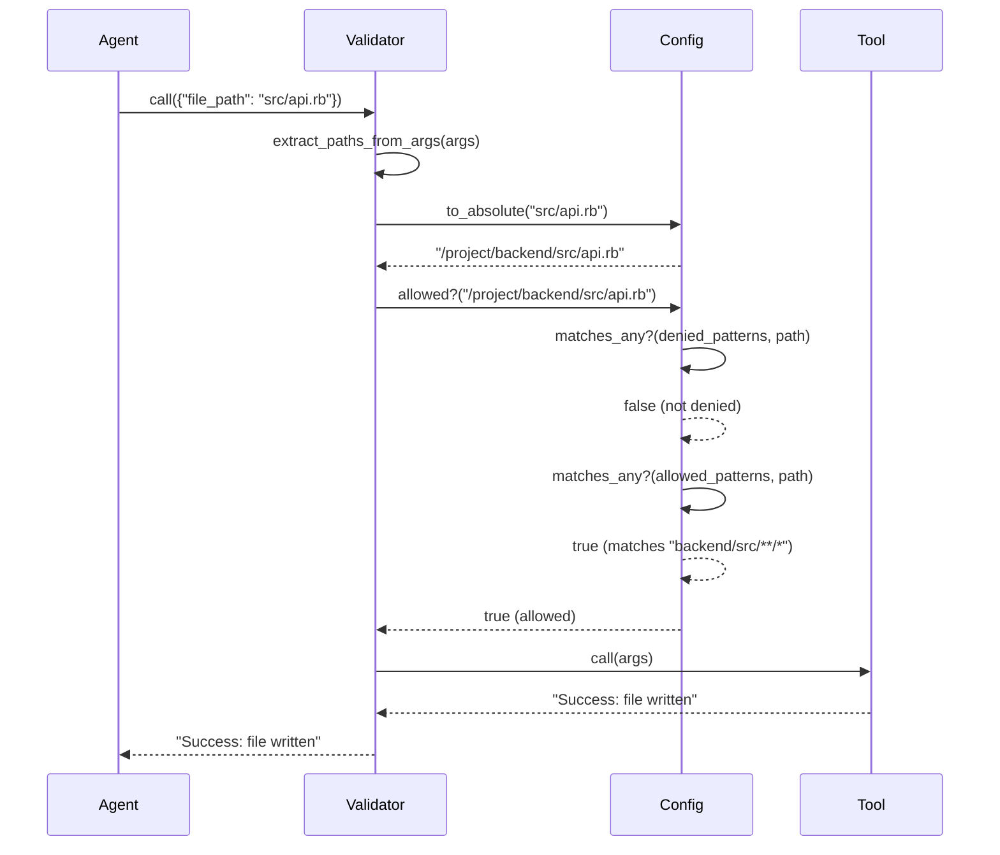

### Error Messages

Permission denied errors are user-friendly:

```
Permission denied: Cannot access '/project/secrets/key.pem'

<system-reminder>
This agent has restricted file access for security.

Tool: write
Attempted: /project/secrets/key.pem

Allowed paths:
  - /project/backend/src/**/*
  - /project/backend/lib/**/*.rb
  - /project/tmp/**

Tip: Check if you can complete the task using allowed directories,
or ask the user to adjust permissions for this agent.
</system-reminder>
```

---

## Scratchpad System

### Overview

**Session-scoped, in-memory storage** for agents to store detailed outputs that would otherwise bloat tool responses.

### Architecture

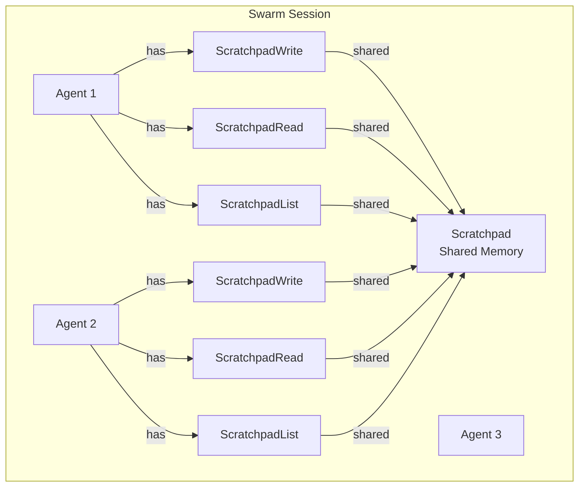

### Features

- ✅ **Session-scoped**: Cleared when swarm execution completes
- ✅ **Shared**: Any agent can read/write any scratchpad address
- ✅ **Path-based**: Hierarchical organization (e.g., `reports/analysis/performance`)
- ✅ **In-memory**: Pure memory storage, no filesystem I/O
- ✅ **Metadata-rich**: Stores content + title + timestamp + size
- ✅ **Size limits**: 1MB per entry, 100MB total

### API

#### Write

```ruby
scratchpad_write(
  file_path: "analysis/performance",
  content: "Detailed performance analysis with 500 lines of logs...",
  title: "Performance Analysis Report"
)
# => "Stored at scratchpad://analysis/performance (450.5KB)"
```

#### Read

```ruby
scratchpad_read(file_path: "analysis/performance")
# => "Detailed performance analysis with 500 lines of logs..."
```

#### List

```ruby
scratchpad_list(prefix: "analysis/")
# => "Scratchpad contents (3 entries):
#       scratchpad://analysis/performance - 'Performance Analysis' (450.5KB)
#       scratchpad://analysis/memory - 'Memory Usage Report' (120.3KB)
#       scratchpad://analysis/disk - 'Disk I/O Analysis' (89.1KB)"
```

### Use Cases

#### 1. Large Analysis Results

Store detailed analysis without bloating tool responses:

```ruby
# Agent A: Perform deep analysis
scratchpad_write(
  file_path: "reports/security_audit",
  content: "... 5000 lines of detailed security findings ...",
  title: "Security Audit Report"
)

# Return brief summary
"Security audit complete. Found 15 issues (3 critical, 12 minor).
 Full report: scratchpad://reports/security_audit"

# Agent B: Read detailed results
scratchpad_read(file_path: "reports/security_audit")
```

#### 2. Agent Collaboration

Share information between agents:

```ruby
# Frontend agent
scratchpad_write(
  file_path: "shared/api_contracts",
  content: "POST /users: { email, password }...",
  title: "API Contract Definitions"
)

# Backend agent
contracts = scratchpad_read(file_path: "shared/api_contracts")
# Use contracts to implement endpoints
```

#### 3. Code Generation

Store generated code for review:

```ruby
scratchpad_write(
  file_path: "generated/user_model",
  content: "class User\n  ...",
  title: "Generated User Model"
)

# Coordinator reviews before applying
code = scratchpad_read(file_path: "generated/user_model")
write(file_path: "models/user.rb", content: code)
```

### Size Limits

```ruby
# Maximum per entry: 1MB
scratchpad_write(
  file_path: "big",
  content: "x" * 2_000_000
)
# => Error: Content exceeds maximum size (1.0MB). Current: 2.0MB

# Maximum total: 100MB
100.times do |i|
  scratchpad_write(
    file_path: "file_#{i}",
    content: "x" * 1_000_000
  )
end
# => Error: Scratchpad full (100.0MB limit). Current: 99.0MB,
#    Would be: 100.0MB. Clear old entries or use smaller content.
```

### Implementation

```ruby
# lib/swarm_sdk/scratchpad.rb
class Scratchpad
  MAX_ENTRY_SIZE = 1_000_000    # 1MB
  MAX_TOTAL_SIZE = 100_000_000  # 100MB

  Entry = Struct.new(:content, :title, :created_at, :size, keyword_init: true)

  def initialize
    @entries = {}
    @total_size = 0
  end

  def write(file_path:, content:, title:)
    # Size checks
    raise ArgumentError, "..." if content.bytesize > MAX_ENTRY_SIZE

    # Calculate new total
    existing_size = @entries[file_path]&.size || 0
    new_total = @total_size - existing_size + content.bytesize
    raise ArgumentError, "..." if new_total > MAX_TOTAL_SIZE

    # Store entry
    entry = Entry.new(
      content: content,
      title: title,
      created_at: Time.now,
      size: content.bytesize
    )
    @entries[file_path] = entry
    @total_size = new_total

    entry
  end

  def read(file_path:)
    entry = @entries[file_path]
    raise ArgumentError, "..." unless entry
    entry.content
  end

  def list(prefix: nil)
    entries = @entries
    entries = entries.select { |path, _| path.start_with?(prefix) } if prefix
    entries.map { |path, entry| { path: path, title: entry.title, ... } }
  end
end
```

### Lifecycle

1. **Creation**: Each swarm creates a scratchpad instance
2. **Sharing**: All agents in the swarm share the same scratchpad
3. **Tools**: All agents automatically get scratchpad tools
4. **Cleanup**: Scratchpad cleared when swarm execution completes (garbage collected)

### Best Practices

✅ **DO**:
- Store large analysis results
- Share data between agents
- Use hierarchical paths (`reports/security/audit_2024`)
- Keep responses concise, details in scratchpad

❌ **DON'T**:
- Store sensitive data (in-memory only, no encryption)
- Store files permanently (session-scoped)
- Use as a database (not persistent)
- Exceed size limits (1MB/entry, 100MB total)

---

## Error Handling

### Error Types

```ruby
module SwarmSDK
  class Error < StandardError; end
  class ConfigurationError < Error; end
  class AgentNotFoundError < Error; end
  class CircularDependencyError < Error; end
  class ToolExecutionError < Error; end
  class LLMError < Error; end
end
```

### Configuration Errors

**Raised during configuration loading/validation**:

```ruby
# Missing required fields
raise ConfigurationError, "Missing 'version' field"
raise ConfigurationError, "SwarmSDK requires version: 2"

# Invalid agent references
raise ConfigurationError, "Lead agent 'main' not found in agents"
raise ConfigurationError, "Agent 'backend' delegates to unknown agent 'cache'"

# Circular dependencies
raise CircularDependencyError, "Circular dependency detected: a -> b -> c -> a"

# Directory validation
raise ConfigurationError, "Directory './backend' does not exist"

# Tool validation
raise ConfigurationError, "Unknown tool: InvalidTool"
```

**Handling**:
```ruby
begin
  swarm = Swarm.load("swarm.yml")
rescue ConfigurationError => e
  puts "Configuration error: #{e.message}"
  exit 1
end
```

### Agent Not Found

**Raised when accessing non-existent agent**:

```ruby
begin
  agent = swarm.agent(:nonexistent)
rescue AgentNotFoundError => e
  puts "Error: #{e.message}"
end
```

### LLM Errors

**Raised for LLM API failures**:

```ruby
# Proxy/server errors
begin
  result = swarm.execute("Build API")
rescue TypeError => e
  if e.message.include?("does not have #dig method")
    # Converted to LLMError automatically
    result.error  # => LLMError: "LLM API request failed: The proxy/server at '...'
                   #               returned an invalid response..."
  end
end
```

### Tool Errors

**Returned as strings (not raised)**:

Tools return error messages rather than raising exceptions:

```ruby
# Permission denied
result = write_tool.execute(file_path: "forbidden.txt", content: "...")
# => "Permission denied: Cannot access '/path/to/forbidden.txt'..."

# File not found
result = read_tool.execute(file_path: "missing.txt")
# => "Error: File does not exist."

# Invalid arguments
result = bash_tool.execute(command: "")
# => "Error: command is required"
```

### Result Error Handling

**Check result for errors**:

```ruby
result = swarm.execute("Build API")

if result.success?
  puts result.content
  puts "Cost: $#{result.total_cost}"
else
  puts "Error: #{result.error.message}"
  puts "Error type: #{result.error.class}"

  # Logs still available for debugging
  result.logs.each do |entry|
    puts entry.inspect
  end
end
```

### Graceful Degradation

SwarmSDK handles errors gracefully:

1. **Tool execution errors**: Returned to agent as error messages, agent can retry
2. **LLM API errors**: Wrapped in Result with error field
3. **Delegation errors**: Caught and returned as tool result strings
4. **Timeout errors**: Caught and formatted with helpful messages

### Error Recovery

**Timeouts**:
```ruby
# Network timeouts
begin
  result = backend_tool.execute(task: "Long-running task")
rescue Faraday::TimeoutError
  # Automatically handled by delegation tool
  # => "Error: Request to backend timed out. The agent may be overloaded..."
end

# Bash command timeouts
bash_tool.execute(command: "sleep 1000", timeout: 5000)
# => "Error: Command timed out after 5.0 seconds..."
```

**Retry Logic** (user responsibility):
```ruby
def execute_with_retry(swarm, prompt, max_retries: 3)
  retries = 0

  loop do
    result = swarm.execute(prompt)
    return result if result.success?

    retries += 1
    break if retries >= max_retries

    puts "Attempt #{retries} failed, retrying..."
    sleep(2 ** retries)  # Exponential backoff
  end

  result
end
```

### Debugging Failed Executions

```ruby
result = swarm.execute("Build API")

if result.failure?
  puts "Error: #{result.error.message}"
  puts "Duration: #{result.duration}s"
  puts "Agent: #{result.agent}"

  # Analyze logs
  result.logs.each do |entry|
    case entry[:type]
    when "user_request"
      puts "LLM request: #{entry[:agent]} (#{entry[:model]})"
    when "agent_stop"
      if entry[:finish_reason] == "stop"
        puts "Response: #{entry[:content]}"
      else
        puts "Tool calls: #{entry[:tool_calls].size}"
      end
    when "tool_call"
      puts "Tool: #{entry[:tool]} - #{entry[:arguments]}"
    when "tool_result"
      puts "Result: #{entry[:result]}"
    when "agent_delegation"
      puts "Delegating to: #{entry[:delegate_to]}"
    end
  end
end
```

---

## Data Flow

### Complete Request/Response Flow

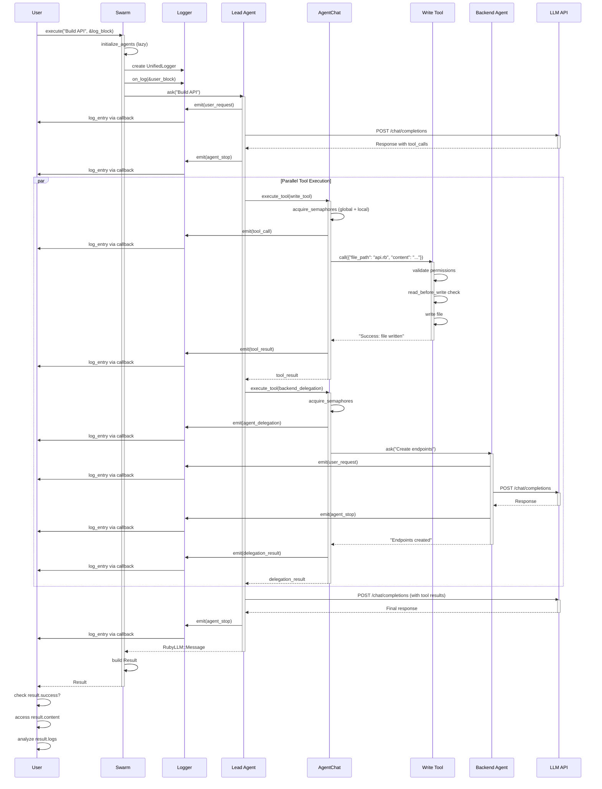

### Simplified Flow Diagrams

#### Basic Execution

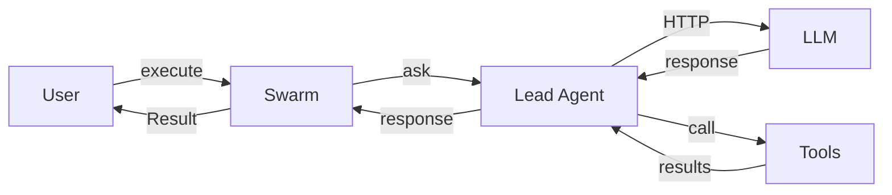

#### With Delegation

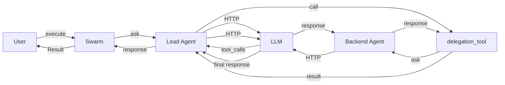

---

## Summary

SwarmSDK v2 is a **complete reimagining** of Claude Swarm's multi-agent AI orchestration:

### Key Innovations

1. **Single Process**: Eliminated inter-process communication overhead
2. **RubyLLM Integration**: Unified interface for multiple LLM providers
3. **Direct Tool Calling**: Method calls instead of MCP protocol
4. **Parallel Execution**: Built-in concurrency with rate limiting
5. **Unified Logging**: Comprehensive observability
6. **Permission System**: Security by default
7. **Scratchpad Memory**: Shared memory for collaboration
8. **Dual API**: Ruby for programmatic use, YAML for convenience

### Getting Started

1. **Install**: `gem install swarm_sdk`
2. **Configure**: Create `swarm.yml` or use Ruby API
3. **Execute**: `swarm.execute("Your task")`
4. **Monitor**: Stream logs and check results

### Next Steps

- Read example code in `lib/swarm_sdk/examples/`
- Review tests for advanced usage patterns
- Consult individual component documentation
- Join the community discussions

**Welcome to SwarmSDK v2** - Build collaborative AI systems with confidence! 🚀

---

## YAML Hooks Feature

SwarmSDK provides a **YAML-only hooks feature** for executing shell commands at lifecycle events, similar to Claude Code hooks. This is **separate from and complementary to** the Ruby callback system.

### Hooks vs Callbacks

- **Callbacks** (above): Ruby procs - programmatic, in-process, full power
- **Hooks** (this section): Shell commands - YAML-only, external scripts

**Use callbacks for**: Complex logic, state management, programmatic control  
**Use hooks for**: Simple validation scripts, external tools, YAML configurations

### Configuration

```yaml
swarm:
  # Swarm-level hooks (swarm_start, swarm_stop only)
  hooks:
    swarm_start:
      - type: command
        command: "echo 'Starting' >> log.txt"

  # All-agents hooks (applied to all agents)
  all_agents:
    hooks:
      pre_tool_use:
        - matcher: "Write|Edit"
          type: command
          command: "rubocop --stdin"
          timeout: 10

  agents:
    backend:
      hooks:
        pre_tool_use:
          - matcher: "Bash"
            type: command
            command: "ruby validate_bash.rb"
```

### Exit Code Behavior

| Exit Code | Behavior |
|-----------|----------|
| **0** | ✅ Success: stdout logged, continues. stdout shown to agent for `user_prompt`/`swarm_start` |
| **1** | ⚠️ Warning: stderr logged, continues |
| **2** | ❌ Blocking: stderr logged, behavior varies by event |

**Exit 2 blocking**:
- `pre_tool_use`: Blocks tool, stderr → agent
- `post_tool_use`: Tool ran, stderr → agent  
- `user_prompt`: Blocks prompt, stderr → log only
- `agent_stop`: Blocks stop, stderr → agent

### Examples

22 test scenarios in `lib/swarm_sdk/examples/hooks/`:
```bash
bundle exec exe/swarm run lib/swarm_sdk/examples/hooks/pre_tool_use_exit_2.yml -p "test"
```

See `lib/swarm_sdk/examples/hooks/README.md` for complete documentation.

---
