# SwarmSDK Execution Flow

This document shows the **runtime execution flow** - what actually happens when you execute a prompt through SwarmSDK.

## Complete Execution Flow

```mermaid
flowchart TD
    START([User sends prompt]) --> LOAD{How is swarm created?}

    LOAD --> |CLI command| CLI_PARSE[CLI parses arguments]
    LOAD --> |SDK code| SDK_CREATE[SDK creates swarm]

    CLI_PARSE --> LOAD_CONFIG[Load configuration file]
    SDK_CREATE --> LOAD_CONFIG

    LOAD_CONFIG --> PARSE_CONFIG[Parse YAML or execute Ruby DSL]
    PARSE_CONFIG --> VALIDATE_CONFIG{Valid configuration?}

    VALIDATE_CONFIG --> |No| ERROR_RETURN[Return validation errors]
    VALIDATE_CONFIG --> |Yes| CREATE_SWARM[Create Swarm instance]

    ERROR_RETURN --> END_ERROR([End with errors])

    CREATE_SWARM --> STORE_AGENTS[Store agent definitions]
    STORE_AGENTS --> SETUP_HOOKS[Setup hook registry]
    SETUP_HOOKS --> READY[Swarm ready]

    READY --> EXECUTE[swarm.execute called]
    EXECUTE --> SETUP_LOGGING{Logging enabled?}

    SETUP_LOGGING --> |Yes| INIT_LOGGER[Initialize LogStream & LogCollector]
    SETUP_LOGGING --> |No| HOOK_SWARM_START
    INIT_LOGGER --> HOOK_SWARM_START[Trigger swarm_start hooks]

    HOOK_SWARM_START --> HOOK_START_RESULT{Hook result?}
    HOOK_START_RESULT --> |halt| END_ERROR
    HOOK_START_RESULT --> |replace| MODIFY_PROMPT[Append hook output to prompt]
    HOOK_START_RESULT --> |continue| CHECK_FIRST
    MODIFY_PROMPT --> CHECK_FIRST

    CHECK_FIRST{First message?} --> |Yes| HOOK_FIRST[Trigger first_message hooks]
    CHECK_FIRST --> |No| INIT_CHECK
    HOOK_FIRST --> INIT_CHECK

    INIT_CHECK{Agents initialized?} --> |No| INIT_AGENTS[Initialize agents - 5 passes]
    INIT_CHECK --> |Yes| EXEC_LOOP

    INIT_AGENTS --> PASS1[Pass 1: Create Agent::Chat instances]
    PASS1 --> CREATE_TOOLS[Create tools with permissions]
    CREATE_TOOLS --> REGISTER_MCP[Register MCP servers]
    REGISTER_MCP --> PLUGIN_INIT[Plugin initialization]
    PLUGIN_INIT --> CREATE_STORAGE{Memory enabled?}

    CREATE_STORAGE --> |Yes| MEMORY_STORAGE[Create memory storage]
    CREATE_STORAGE --> |No| PASS2
    MEMORY_STORAGE --> REGISTER_MEMORY_TOOLS[Register memory tools]
    REGISTER_MEMORY_TOOLS --> PASS2

    PASS2[Pass 2: Register delegation tools]
    PASS2 --> PASS3[Pass 3: Setup agent contexts]
    PASS3 --> PASS4[Pass 4: Configure hook callbacks]
    PASS4 --> PASS5[Pass 5: Apply YAML hooks]
    PASS5 --> EMIT_AGENT_START[Emit agent_start events]
    EMIT_AGENT_START --> EXEC_LOOP

    EXEC_LOOP[Execution Loop Start]
    EXEC_LOOP --> USER_PROMPT[Lead agent receives prompt]

    USER_PROMPT --> HOOK_USER_PROMPT[Trigger user_prompt hooks]
    HOOK_USER_PROMPT --> MEMORY_DISCOVER{Memory enabled?}

    MEMORY_DISCOVER --> |Yes| SKILL_DISCOVERY[Semantic skill discovery]
    MEMORY_DISCOVER --> |No| RATE_LIMIT

    SKILL_DISCOVERY --> CHECK_SKILLS{Skills found?}
    CHECK_SKILLS --> |Yes| LOAD_SKILLS[Auto-load skills as tools]
    CHECK_SKILLS --> |No| RATE_LIMIT
    LOAD_SKILLS --> RATE_LIMIT

    RATE_LIMIT[Acquire rate limit semaphore]
    RATE_LIMIT --> SEND_LLM[Send to LLM API]

    SEND_LLM --> LLM_RESPONSE{Response type?}

    LLM_RESPONSE --> |Text only| FINAL_RESPONSE
    LLM_RESPONSE --> |Tool calls| EMIT_STEP[Emit agent_step event]

    EMIT_STEP --> TOOL_LOOP[Process each tool call]

    TOOL_LOOP --> HOOK_PRE[Trigger pre_tool_use hook]
    HOOK_PRE --> HOOK_PRE_RESULT{Hook result?}

    HOOK_PRE_RESULT --> |halt| STOP_EXECUTION[Stop execution]
    HOOK_PRE_RESULT --> |replace| MODIFY_TOOL[Modify tool parameters]
    HOOK_PRE_RESULT --> |continue| CHECK_TOOL_TYPE
    MODIFY_TOOL --> CHECK_TOOL_TYPE

    CHECK_TOOL_TYPE{Tool type?}

    CHECK_TOOL_TYPE --> |Delegation| DELEGATE_START[Call delegate agent]
    CHECK_TOOL_TYPE --> |Memory| MEMORY_OP
    CHECK_TOOL_TYPE --> |File| FILE_OP
    CHECK_TOOL_TYPE --> |Bash| BASH_OP
    CHECK_TOOL_TYPE --> |Default| DEFAULT_OP
    CHECK_TOOL_TYPE --> |Scratchpad| SCRATCHPAD_OP

    %% Delegation flow
    DELEGATE_START --> HOOK_PRE_DELEGATE[Trigger pre_delegation hook]
    HOOK_PRE_DELEGATE --> RECURSIVE_ASK[Recursively call agent.ask]
    RECURSIVE_ASK --> HOOK_POST_DELEGATE[Trigger post_delegation hook]
    HOOK_POST_DELEGATE --> TOOL_RESULT

    %% Memory operations
    MEMORY_OP{Memory operation?}
    MEMORY_OP --> |MemoryWrite| EXTRACT_META[Extract frontmatter metadata]
    MEMORY_OP --> |MemoryRead| FETCH_ENTRY[Fetch entry from storage]
    MEMORY_OP --> |MemoryGrep| SEMANTIC_SEARCH[Perform semantic search]
    MEMORY_OP --> |MemoryEdit| EDIT_ENTRY[Edit existing entry]
    MEMORY_OP --> |LoadSkill| LOAD_SKILL_EXEC[Load skill and swap tools]

    EXTRACT_META --> GENERATE_EMBED[Generate embedding with ONNX]
    GENERATE_EMBED --> UPDATE_INDEX[Update FAISS vector index]
    UPDATE_INDEX --> PERSIST[Persist to filesystem]
    PERSIST --> TOOL_RESULT

    FETCH_ENTRY --> FOLLOW_STUB{Is stub?}
    FOLLOW_STUB --> |Yes| REDIRECT[Follow redirect]
    FOLLOW_STUB --> |No| RETURN_CONTENT
    REDIRECT --> RETURN_CONTENT[Return content]
    RETURN_CONTENT --> TOOL_RESULT

    SEMANTIC_SEARCH --> EMBED_QUERY[Embed search query]
    EMBED_QUERY --> FAISS_SEARCH[Search FAISS index]
    FAISS_SEARCH --> RANK_RESULTS[Rank by similarity]
    RANK_RESULTS --> TOOL_RESULT

    EDIT_ENTRY --> TOOL_RESULT
    LOAD_SKILL_EXEC --> SWAP_TOOLS[Replace agent tools]
    SWAP_TOOLS --> TOOL_RESULT

    %% File operations
    FILE_OP{File operation?}
    FILE_OP --> |Read/Glob/Grep| CHECK_READ_PERMS[Check allowed paths]
    FILE_OP --> |Write/Edit| CHECK_WRITE_PERMS[Check allowed/denied paths]

    CHECK_READ_PERMS --> PERMS_OK_READ{Permitted?}
    PERMS_OK_READ --> |Yes| EXEC_READ[Execute file operation]
    PERMS_OK_READ --> |No| PERM_ERROR[Permission denied error]

    CHECK_WRITE_PERMS --> PERMS_OK_WRITE{Permitted?}
    PERMS_OK_WRITE --> |Yes| EXEC_WRITE[Execute file operation]
    PERMS_OK_WRITE --> |No| PERM_ERROR

    EXEC_READ --> TOOL_RESULT
    EXEC_WRITE --> TOOL_RESULT
    PERM_ERROR --> TOOL_RESULT

    %% Bash operations
    BASH_OP --> CHECK_BASH_PERMS[Check denied commands]
    CHECK_BASH_PERMS --> BASH_OK{Permitted?}
    BASH_OK --> |Yes| RUN_BASH[Execute shell command]
    BASH_OK --> |No| BASH_ERROR[Permission denied]
    RUN_BASH --> TOOL_RESULT
    BASH_ERROR --> TOOL_RESULT

    %% Default operations
    DEFAULT_OP{Tool type?}
    DEFAULT_OP --> |Think| THINK_EXEC[Record reasoning]
    DEFAULT_OP --> |TodoWrite| TODO_EXEC[Update task list]
    DEFAULT_OP --> |Clock| CLOCK_EXEC[Return current time]
    DEFAULT_OP --> |WebFetch| WEB_EXEC[Fetch and process URL]

    THINK_EXEC --> TOOL_RESULT
    TODO_EXEC --> TOOL_RESULT
    CLOCK_EXEC --> TOOL_RESULT
    WEB_EXEC --> TOOL_RESULT

    %% Scratchpad operations
    SCRATCHPAD_OP{Operation?}
    SCRATCHPAD_OP --> |Write| SCRATCH_WRITE[Store in volatile memory]
    SCRATCHPAD_OP --> |Read| SCRATCH_READ[Retrieve from memory]
    SCRATCHPAD_OP --> |List| SCRATCH_LIST[List all entries]

    SCRATCH_WRITE --> TOOL_RESULT
    SCRATCH_READ --> TOOL_RESULT
    SCRATCH_LIST --> TOOL_RESULT

    %% Tool result handling
    TOOL_RESULT[Tool result collected]
    TOOL_RESULT --> HOOK_POST[Trigger post_tool_use hook]
    HOOK_POST --> HOOK_POST_RESULT{Hook result?}

    HOOK_POST_RESULT --> |halt| STOP_EXECUTION
    HOOK_POST_RESULT --> |replace| MODIFY_RESULT[Modify tool result]
    HOOK_POST_RESULT --> |continue| MORE_TOOLS
    MODIFY_RESULT --> MORE_TOOLS

    MORE_TOOLS{More tools?} --> |Yes| TOOL_LOOP
    MORE_TOOLS --> |No| SEND_RESULTS[Send all results to LLM]

    SEND_RESULTS --> LLM_CONTINUES{LLM continues?}
    LLM_CONTINUES --> |More tool calls| EMIT_STEP
    LLM_CONTINUES --> |Final response| FINAL_RESPONSE

    FINAL_RESPONSE[LLM returns final text response]
    FINAL_RESPONSE --> EMIT_AGENT_STOP[Emit agent_stop event]
    EMIT_AGENT_STOP --> HOOK_SWARM_STOP[Trigger swarm_stop hooks]

    HOOK_SWARM_STOP --> HOOK_STOP_RESULT{Hook result?}
    HOOK_STOP_RESULT --> |reprompt| MODIFY_REPROMPT[Modify prompt]
    HOOK_STOP_RESULT --> |finish_swarm| BUILD_RESULT
    HOOK_STOP_RESULT --> |continue| BUILD_RESULT

    MODIFY_REPROMPT --> EXEC_LOOP

    BUILD_RESULT[Build Result object]
    BUILD_RESULT --> CALC_COST[Calculate total cost & tokens from logs]
    CALC_COST --> CLEANUP[Cleanup MCP clients]
    CLEANUP --> RESET_LOGGING{Logging was enabled?}

    RESET_LOGGING --> |Yes| RESET_STREAMS[Reset LogStream & LogCollector]
    RESET_LOGGING --> |No| RETURN_RESULT
    RESET_STREAMS --> RETURN_RESULT

    RETURN_RESULT[Return Result to user]
    RETURN_RESULT --> FORMAT{CLI or SDK?}

    FORMAT --> |CLI| RENDER_OUTPUT[Render formatted output]
    FORMAT --> |SDK| DIRECT_RETURN[Return Result object]

    RENDER_OUTPUT --> DISPLAY[Display to terminal]
    DIRECT_RETURN --> CODE[Return to calling code]

    DISPLAY --> END_SUCCESS([Execution complete])
    CODE --> END_SUCCESS
    STOP_EXECUTION --> END_ERROR

    %% Styling
    classDef userAction fill:#e1f5ff,stroke:#0366d6,stroke-width:3px
    classDef config fill:#e8f5e9,stroke:#4caf50,stroke-width:2px
    classDef initialization fill:#fff3e0,stroke:#ff9800,stroke-width:2px
    classDef hooks fill:#fce4ec,stroke:#e91e63,stroke-width:2px
    classDef llm fill:#f3e5f5,stroke:#9c27b0,stroke-width:2px
    classDef tools fill:#e0f2f1,stroke:#009688,stroke-width:2px
    classDef memory fill:#fff3e0,stroke:#ff6f00,stroke-width:2px
    classDef result fill:#e8eaf6,stroke:#3f51b5,stroke-width:2px
    classDef decision fill:#fff9c4,stroke:#fbc02d,stroke-width:2px

    class START,END_SUCCESS,END_ERROR userAction
    class LOAD_CONFIG,PARSE_CONFIG,VALIDATE_CONFIG config
    class CREATE_SWARM,STORE_AGENTS,SETUP_HOOKS,READY,INIT_AGENTS,PASS1,CREATE_TOOLS,REGISTER_MCP,PLUGIN_INIT,PASS2,PASS3,PASS4,PASS5,EMIT_AGENT_START initialization
    class HOOK_SWARM_START,HOOK_FIRST,HOOK_USER_PROMPT,HOOK_PRE,HOOK_POST,HOOK_PRE_DELEGATE,HOOK_POST_DELEGATE,HOOK_SWARM_STOP,HOOK_START_RESULT,HOOK_PRE_RESULT,HOOK_POST_RESULT,HOOK_STOP_RESULT hooks
    class SEND_LLM,LLM_RESPONSE,SEND_RESULTS,LLM_CONTINUES,FINAL_RESPONSE,RATE_LIMIT llm
    class TOOL_LOOP,CHECK_TOOL_TYPE,FILE_OP,BASH_OP,DEFAULT_OP,SCRATCHPAD_OP,TOOL_RESULT,DELEGATE_START,RECURSIVE_ASK,EXEC_READ,EXEC_WRITE,RUN_BASH,THINK_EXEC,TODO_EXEC,CLOCK_EXEC,WEB_EXEC,SCRATCH_WRITE,SCRATCH_READ,SCRATCH_LIST,CHECK_READ_PERMS,CHECK_WRITE_PERMS,CHECK_BASH_PERMS tools
    class MEMORY_DISCOVER,SKILL_DISCOVERY,LOAD_SKILLS,CREATE_STORAGE,MEMORY_STORAGE,REGISTER_MEMORY_TOOLS,MEMORY_OP,EXTRACT_META,GENERATE_EMBED,UPDATE_INDEX,PERSIST,FETCH_ENTRY,SEMANTIC_SEARCH,EMBED_QUERY,FAISS_SEARCH,RANK_RESULTS,EDIT_ENTRY,LOAD_SKILL_EXEC,SWAP_TOOLS,FOLLOW_STUB,REDIRECT,RETURN_CONTENT memory
    class BUILD_RESULT,CALC_COST,CLEANUP,RETURN_RESULT,RENDER_OUTPUT,DISPLAY,DIRECT_RETURN,CODE result
    class LOAD,VALIDATE_CONFIG,SETUP_LOGGING,HOOK_START_RESULT,CHECK_FIRST,INIT_CHECK,CREATE_STORAGE,LLM_RESPONSE,HOOK_PRE_RESULT,CHECK_TOOL_TYPE,MEMORY_OP,FILE_OP,BASH_OP,DEFAULT_OP,SCRATCHPAD_OP,HOOK_POST_RESULT,MORE_TOOLS,LLM_CONTINUES,HOOK_STOP_RESULT,RESET_LOGGING,FORMAT,PERMS_OK_READ,PERMS_OK_WRITE,BASH_OK,CHECK_SKILLS,FOLLOW_STUB decision
```



## Step-by-Step Execution

### Phase 1: Configuration & Initialization

1. **User Input**
   - CLI: `swarm run config.yml -p "Build authentication"`
   - SDK: `swarm.execute("Build authentication")`

2. **Load Configuration**
   - Parse YAML file or Ruby DSL
   - Resolve agent file references
   - Validate configuration structure
   - Return errors if invalid

3. **Create Swarm**
   - Create Swarm instance with name and settings
   - Store agent definitions (not yet initialized)
   - Setup hook registry with default logging hooks
   - Apply YAML hooks to registry if present

### Phase 2: Execution Start

4. **Execute Called**
   - `swarm.execute("prompt")` is called
   - Setup logging if callback block provided
   - Record start time for duration tracking

5. **Swarm Start Hooks**
   - Trigger `swarm_start` hooks
   - Can halt execution or append context to prompt
   - Default hook emits `swarm_start` event to logs

6. **First Message Hooks** (first execution only)
   - Trigger `first_message` hooks
   - Can halt before any LLM interaction

### Phase 3: Agent Initialization (Lazy, First Execution Only)

7. **5-Pass Initialization**

   **Pass 1: Create Agents**
   - Create `Agent::Chat` instance for each agent
   - Register explicit tools (from config)
   - Register default tools (Read, Grep, Glob, Think, TodoWrite, etc.)
   - Wrap tools with permissions validators
   - Connect to MCP servers for external tools
   - Initialize plugins (create memory storage if enabled)
   - Register plugin tools (memory tools if memory enabled)

   **Pass 2: Delegation Tools**
   - Create delegation tools for inter-agent communication
   - Each delegation tool wraps target agent's `ask()` method

   **Pass 3: Agent Contexts**
   - Create `Agent::Context` for tracking delegations
   - Setup logging callbacks if logging enabled
   - Emit validation warnings for model mismatches

   **Pass 4: Hook System**
   - Configure hook callbacks for each agent
   - Link to swarm's hook registry

   **Pass 5: YAML Hooks**
   - Apply YAML shell command hooks if present
   - Convert to Ruby hook callbacks

   **Emit agent_start events**

### Phase 4: Lead Agent Execution

8. **Send Prompt to Lead Agent**
   - Lead agent receives the user's prompt
   - Enters Async reactor for parallel execution

9. **User Prompt Hooks**
   - Trigger `user_prompt` hooks
   - Can modify or validate the prompt
   - Default hook emits `user_prompt` event

10. **Memory Semantic Skill Discovery** (if memory enabled)
    - Search memory for skills matching prompt
    - Use semantic search (embeddings + FAISS)
    - Auto-load matching skills as tools (dynamic tool swapping)

11. **Rate Limiting**
    - Acquire global semaphore (max concurrent LLM calls across swarm)
    - Prevents API quota exhaustion in large swarms

12. **Send to LLM**
    - Send messages + tools to configured LLM API
    - Wait for response (streaming or blocking)

### Phase 5: Tool Execution Loop

13. **LLM Response**
    - **Text only**: Go to final response
    - **Tool calls**: Emit `agent_step` event and process tools

14. **For Each Tool Call** (parallel execution)

    **Pre-Tool Hook**
    - Trigger `pre_tool_use` hook with matcher pattern
    - Can halt, modify parameters, or continue

    **Acquire Local Semaphore**
    - Limit concurrent tool calls for this agent
    - Prevents overwhelming single agent

    **Check Permissions**
    - File tools: Validate allowed/denied paths
    - Bash: Validate denied command patterns
    - Block if permissions deny

    **Execute Tool** (depends on type):

    - **Delegation Tool**:
      - Trigger `pre_delegation` hook
      - Recursively call target agent's `ask()` method
      - Trigger `post_delegation` hook
      - Return delegate's response

    - **Memory Tools**:
      - **MemoryWrite**: Extract metadata → Generate embedding → Update FAISS index → Persist
      - **MemoryRead**: Fetch from storage → Follow redirects if stub → Return content
      - **MemoryGrep**: Embed query → Search FAISS → Rank by similarity → Return matches
      - **MemoryEdit**: Update existing entry → Re-index if needed
      - **LoadSkill**: Search for skill → Load into memory → Swap tools dynamically

    - **File Tools** (Read/Write/Edit/Glob/Grep):
      - Resolve paths relative to agent's directory
      - Execute file operation
      - Return content/results

    - **Bash Tool**:
      - Execute shell command in agent's directory
      - Capture stdout/stderr
      - Return output

    - **Default Tools**:
      - **Think**: Record reasoning (creates attention sink)
      - **TodoWrite**: Update task list state
      - **Clock**: Return current timestamp
      - **WebFetch**: Fetch URL → Convert to markdown → Process with LLM → Return

    - **Scratchpad Tools**:
      - **ScratchpadWrite**: Store in volatile shared memory
      - **ScratchpadRead**: Retrieve from shared memory
      - **ScratchpadList**: List all entries

    **Post-Tool Hook**
    - Trigger `post_tool_use` hook
    - Can halt, modify result, or continue
    - Emit `tool_result` event

15. **More Tools?**
    - If more tool calls: Continue parallel execution
    - If all done: Send results back to LLM

16. **LLM Continues**
    - LLM processes tool results
    - May request more tools (loop back to step 13)
    - Or return final text response

### Phase 6: Response Completion

17. **Final Response**
    - LLM returns text response (no more tool calls)
    - Emit `agent_stop` event with usage stats

18. **Swarm Stop Hooks**
    - Trigger `swarm_stop` hooks
    - Can request reprompt (loop back to step 8 with new prompt)
    - Can finish swarm early
    - Default hook emits `swarm_stop` event with summary

19. **Build Result**
    - Create `Result` object with response content
    - Calculate total cost from usage logs
    - Calculate total tokens from usage logs
    - Collect all logs from execution
    - Record total duration

20. **Cleanup**
    - Stop all MCP client connections
    - Reset logging streams if logging was enabled
    - Release semaphores

21. **Return Result**
    - CLI: Format output (Markdown, JSON, or quiet mode) → Display
    - SDK: Return Result object directly to calling code

### Node Workflow Variation

If the swarm uses **Node Workflows** (multi-stage execution):

1. Build execution order from node dependencies (topological sort)
2. For each node in order:
   - Apply input transformer (Bash/Ruby) to previous node's output
   - Create mini-swarm with node's agents
   - Execute mini-swarm with transformed input
   - NodeContext can:
     - `goto_node(name)`: Jump to different node
     - `halt_workflow()`: Stop entire workflow
     - `skip_execution()`: Skip LLM and use provided content
   - Collect node result
3. Pass node output to dependent nodes
4. Return final node's result

## Parallel Execution

Multiple operations happen **concurrently**:

- **Tool calls**: Execute in parallel within semaphore limits
- **LLM requests**: Multiple agents can call LLMs simultaneously (global semaphore)
- **Delegation**: Recursive agent calls run independently
- **File I/O**: Non-blocking with Async fiber scheduler

## Key Decision Points

1. **Configuration valid?** → Continue or return errors
2. **Logging enabled?** → Setup LogStream or skip
3. **First message?** → Trigger first_message hooks or skip
4. **Agents initialized?** → Run 5-pass init or skip
5. **Memory enabled?** → Skill discovery or skip
6. **Hook results** → Halt, modify, or continue
7. **Tool type?** → Route to appropriate handler
8. **Permissions ok?** → Execute or deny
9. **More tools?** → Continue loop or send to LLM
10. **LLM continues?** → More tools or final response
11. **Swarm stop hook?** → Reprompt, finish, or continue

## Event Timeline

```
Time →

[User] ━━━━━━━━━━━━━━━━━━━━━━━━━━━━━━━━━━━━━━━━━━━━━━━━━━━━→ [Result]
         │                                                    │
         ├─ swarm_start event                                │
         │                                                    │
         ├─ first_message event (if first time)              │
         │                                                    │
         ├─ agent_start events (all agents)                  │
         │                                                    │
         ├─ user_prompt event                                │
         │                                                    │
         ├─ tool_call events ┐                               │
         ├─ tool_result events┘ (repeated)                   │
         │                                                    │
         ├─ agent_step events (each LLM turn)                │
         │                                                    │
         ├─ agent_stop event (final response)                │
         │                                                    │
         └─ swarm_stop event ─────────────────────────────────┘
```

## Memory Operation Details

### MemoryWrite Flow
```
Content → Extract frontmatter → Generate embedding (ONNX) →
  Update FAISS index → Persist to JSON → Return confirmation
```

### MemoryGrep/Semantic Search Flow
```
Query → Embed query (ONNX) → Search FAISS index →
  Calculate cosine similarity → Rank results →
  Filter by threshold → Return top matches
```

### LoadSkill Flow
```
Skill name → Semantic search + keyword match →
  Load skill content → Parse tool definitions →
  Register new tools → Remove old tools (except immutable) →
  Set active skill → Return confirmation
```

## Error Handling

At any point, errors can occur:

- **Configuration errors**: Stop before execution, return structured errors
- **Hook halt**: Stop execution immediately, return hook message
- **Permission denied**: Return error to LLM, continues execution
- **Tool errors**: Return error to LLM, continues execution
- **LLM errors**: Build Result with error, trigger swarm_stop, return to user
- **MCP errors**: Log warning, continue without external tools

## Concurrent Execution Example

When lead agent delegates to 3 agents simultaneously:

```
Lead Agent sends prompt
  │
  ├─ Acquires global semaphore (1/50)
  └─ Sends to LLM
      │
      └─ LLM returns 3 delegation tool calls
          │
          ├─────────┬─────────┬─────────┐
          │         │         │         │
          ▼         ▼         ▼         ▼
       Tool 1    Tool 2    Tool 3  (parallel)
          │         │         │
          ▼         ▼         ▼
    Agent A   Agent B   Agent C
       │         │         │
       ├─────────┼─────────┤
       │ Each acquires global semaphore (4/50 total)
       ├─────────┼─────────┤
       │         │         │
       ▼         ▼         ▼
    Results collected (parallel)
       │
       └──────── Back to Lead Agent LLM
```

## Reprompting Flow

Swarm stop hooks can request reprompting:

```
swarm_stop hook returns reprompt("Try again with more detail")
  │
  └─ Loop back to step 8 (Lead agent execution)
      │
      └─ Lead agent receives new prompt
          │
          └─ Execution continues...
              │
              └─ Eventually reaches swarm_stop again
```

This enables:
- Validation loops (hook validates output, requests retry)
- Iterative refinement (hook checks quality, asks for improvements)
- Multi-turn workflows (hook orchestrates conversation)
